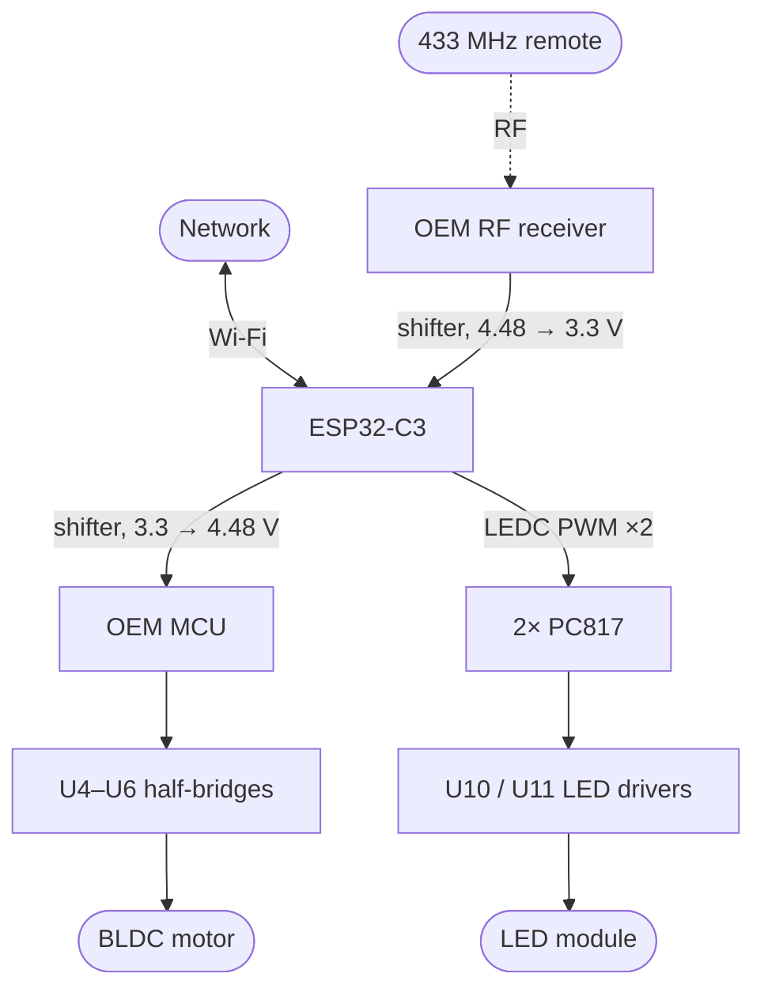

# SmarterFan

Replacing the brain of a **Novohome NH-VTR500** ceiling fan (retractable blades, dimmable CCT LED, 433 MHz remote) with an ESP32, without touching its mains-side power electronics.

The stock firmware is locked in an undocumented mask-ROM MCU: the lowest brightness step is still uncomfortably bright, there are three fixed colour temperatures, and the only way in is the handheld remote. This project intercepts the two control paths that matter — the LED dimming lines and the RF receiver's output — and leaves the rectifier, LED drivers, isolation barrier and motor stage exactly as built.

**Status:** installed and running in the fan. Both interventions are done and confirmed on hardware — the ESP32 drives the LEDs far below the OEM floor, and fan commands relay through it to the OEM MCU. The remote still works. What remains is measurement, not construction: see [Still open](#still-open).

---

## ⚠️ Safety

**This board carries mains voltage and hangs over your head.**

- Roughly the left third of the PCB is mains-referenced. Treat it as live whenever the fan is plugged in.
- The bulk caps are rated 450 V and hold charge. **Bleed and verify with a meter before touching anything.**
- No scope ground clip on the mains-referenced section. Isolation transformer, or a differential probe.
- No USB to the ESP32 while the board is on mains. The secondary is coupled to the line through CY1/CY2 and can float. Use an isolation transformer, a USB isolator, or OTA.
- Uncertified, not fire-tested, voids your warranty and possibly your insurance. **You are responsible for what you hang from your ceiling.**

If any of that is unfamiliar, this is not a good first electronics project.

---

## Scope

In: dimming far below the OEM minimum down to off, continuous colour temperature, network control, sunrise alarm, and the original remote still working.

Out: **slowing the fan below its lowest OEM speed.** Fan commands are routed *through* the stock MCU, so you get the OEM's six speeds from the network instead of only from the remote. The lowest speed is still the lowest speed — see [Out of scope](#out-of-scope).

---

## Target hardware

- **Fan:** Novohome NH-VTR500 — 4 retractable blades, 30 W DC motor, 6 speeds, 56 W LED with 3 colour tones
- **Control board silkscreen:** `XH-FSD03D5-1A`, dated `2025-09-19`

Other fans may use the same board; the silkscreen is the thing to match. If yours differs the approach still applies, but every reference designator below will be wrong.

### The parts that matter

| Ref | Part | Function |
|---|---|---|
| U3 | `MT006MAPN 5702S` | Main MCU, TSSOP-28. No datasheet, no reflash path. |
| U10, U11 | `MT9722S` | Mains-side constant-current LED drivers, one per colour channel |
| U2 (×3) | `PC817` | Optocouplers across the isolation barrier |
| Y1 + SOP-8 | `13.52 MHz` | 433 MHz superheterodyne receiver, feeds the `ANT` wire |
| R37, R38 | `102` (1 kΩ) | MCU → dimming optocoupler drive resistors — **removed** |
| `102` at RF | 1 kΩ | Receiver output → MCU input — **removed** |
| U4, U5, U6 | `4614 GA8T25` ×3 | One half-bridge per motor phase, untouched |
| CE5, CE6 | 2.2 µF 450 V | Bulk caps for the two LED drivers |

Two facts drove the whole design: **the remote is RF, not IR** (a 13.52 MHz crystal beside an SOP-8 with a wire on the `ANT` pad is a 433.92 MHz superhet), and **the dimming floor is a firmware limit, not a hardware one** — nothing in the analogue path forbids going lower.

---

## How it works

Two independent interventions, both reversible, both just resistor removals.



**1. LED dimming — taken over completely.** `R37` and `R38` out isolates the MCU from the two dimming optocouplers, and the ESP32 drives their LEDs directly through its own resistors. The MCU keeps driving its now-disconnected pins; harmless. Sizing:

```
MCU high 4.48 V, post-resistor 1.12 V (PC817 Vf)  →  3.36 mA
From a 3.3 V GPIO: (3.3 − 1.12) / 0.00336 ≈ 650 Ω  →  620 Ω
```

Both pads carry `ledc` PWM at **250 Hz** (not the OEM's 1 kHz — see [Dimming](#dimming)), and the two channels are one `cwww` light: brightness on one axis, channel mix on the other. The mix is normalised by the larger fraction, so mid-colour-temperature is *both* channels at full rather than each at half, and 100% there is the full 56 W. Total output therefore roughly doubles toward the middle of the CCT sweep. That is deliberate — it is what reaching full output costs.

**2. RF — relayed through the ESP32.** The `102` between the receiver's output and the MCU's input comes out and the ESP32 sits in the middle: it taps the receiver through a level shifter and decodes the OOK in software, then reconstructs packets and injects them into the MCU's input, which cannot tell the difference. Fan commands are forwarded; the six light keys stop at the ESP32 and drive the LEDs directly.

**Tradeoff:** the ESP32 is now a single point of failure for the remote. If it hangs, the remote stops working. Watchdog it. Wi-Fi dropping out is *not* a problem — the relay runs on the RMT peripheral and never touches the network stack.

---

## Hardware

### Bill of materials

| Item | Notes |
|---|---|
| **NodeMCU ESP32-C3 SuperMini** | Requires the antenna mod — see [Antenna](#antenna). Socket it, don't solder it down. |
| BSS138 4-channel level shifter | The $1 bidirectional I²C module. Used on the inject line; it works on the sniff line too, though it lifts the pad's low from 0 V to 0.8 V. |
| Buck converter → 5 V | **MP1584.** The LV bus measures **24 V**, inside its 28 V rating — but see [Power](#power) for the margin. |
| 2× 620 Ω | Optocoupler drive |
| 1× 1 kΩ | Series protection on the RF inject line |
| 2× 470 µF, **105 °C or polymer** | Bulk, one on 3V3 and one on 5 V. 85 °C parts dry out in a hot canopy. |
| 2× 100 nF ceramic | One per rail, at the module pins |
| U.FL → SMA pigtail + 2.4 GHz antenna | Route it out of the canopy |
| 1× `CD4050B` *(optional)* | Alternative to a divider on the sniff line. A correctly sized divider works fine — at these timings source impedance is irrelevant. |

**Tools:** oscilloscope (not optional — you cannot do the RF work without one), multimeter, fine-tip iron, hot air or tweezers for 0805 removal, **isolation transformer**, USB isolator if flashing over USB while powered.

### Wiring

```
 LV DC bus (24 V) ──[ MP1584 → 5 V ]──→ ESP32 5V ──(LDO)── 3V3 ──→ shifter LV

 MCU VDD (4.48 V) ───────────────────────────────────────────────→ shifter HV

 secondary GND ───┬── ESP32 GND
                  └── shifter GND

 GPIO 7  ──[620 Ω]──→ opto-side pad of R37   (warm)
 GPIO 10 ──[620 Ω]──→ opto-side pad of R38   (cold)
 GPIO 5  ──→ shifter LV1 ─── HV1 ──[1 kΩ]──→ MCU RF input pad
 GPIO 6  ←──[10k]──┬── RF receiver output pad     (divider: 3.08 V)
                   [22k]
                    │
                   GND
```

| Signal | GPIO | Peripheral |
|---|---|---|
| RF inject | 5 | RMT TX |
| RF sniff | 6 | RMT RX |
| LED warm (`R37`) | 7 | LEDC |
| LED cold (`R38`) | 10 | LEDC |

These four because everything else is spoken for: 11–17 flash, 18/19 USB, 2/8/9 strapping, 20/21 UART0, and 0/1/3/4 are the only ADC1 channels (ADC2 is unusable with Wi-Fi up). Note the classic-ESP32 "avoid GPIO 6–11" rule does **not** apply to the C3. `GPIO 8` is the onboard LED, active low — wire it as a heartbeat, it's the only diagnostic you get without a ladder.

**Critical points:**

- **`HV` comes from the MCU's own 4.48 V rail, not from the 5 V buck.** Driving the MCU's input above its supply forward-biases its ESD diode. Tap at the MCU's decoupling cap; draw is under 1 mA.
- **`LV` = 3.3 V, `HV` = 4.48 V.** Swapping them puts 4.48 V on your GPIOs. Check the silkscreen twice.
- **Do not power the ESP32 from the fan's 4.48 V rail.** It was sized for an 8-bit MCU and an RF receiver, maybe 20 mA. The C3 bursts to ~350 mA.
- **Keep the 1 kΩ in the inject path** — pin protection during power sequencing, contention limiting, EMC, RF front-end isolation.
- Size any sniff divider so the high clears V<sub>IH</sub> = 2.475 V. 10k/22k gives 3.08 V; 10k/10k gives 2.24 V and is below spec.
- Mount resistors on the adapter board, not as flying leads. This thing vibrates for years.

### Power

Take power from the low-voltage DC bus (behind D6, with the 470 µF caps), not the logic rail. **The bus measures 24 V**, which is what makes an MP1584 usable here at all — it is a 28 V part, 30 V absolute maximum.

**That leaves about 4 V of headroom, and the load on the other end of the bus is a motor.** A decelerating BLDC pushes energy back, and the two 470 µF caps are what absorb it; how far the rail actually rises on a 6→off transition has [not been scoped](#still-open). If it clips 28 V the buck is out of spec, and above 30 V it fails — usually shorted, which puts 24 V on the ESP32. A part with real margin (an LM2596HV or a 60 V module) removes the question rather than answering it; a TVS or a zener clamp across the buck's input is the cheaper mitigation if the measurement comes back close.

**Keep the switcher away from the RF section**: shielded inductor, filtering both sides, mounted at the far end, and verify remote range after installation.

### Antenna

The generic C3 SuperMini boards have a documented antenna problem — the SMD antenna sits too close to the ground plane and shields rather than radiates; a quarter-wave wire mod is worth a reported 6–10 dB. Since the antenna has to leave the canopy anyway, **this project treats the mod as mandatory.** Remove the SMD antenna, solder a ~31 mm wire or a U.FL/SMA pigtail to the feed point, then **strain-relieve the joint** — epoxy at the pad, anchor the cable. A hand-soldered joint on a fixture that vibrates for years is a fatigue failure waiting to happen.

Verify with the `wifi_signal` sensor from the real canopy position before closing up. Better than −70 dBm and you'll never think about it again.

---

## Firmware

ESPHome. Two builds, both loading local components from `firmware/components`:

| Build | Needs | Does |
|---|---|---|
| `firmware/sniffer.yaml` | just the sniff tap — **no board modification** | Decodes the remote and prints it. Receive-only; this is the bring-up config. |
| `firmware/relay.yaml` | **both** modifications | The same decode, plus injection into the MCU's RF input, `fan_rf.send_key` for automations, the two LED channels as a `cwww` light driven from the remote's light keys, and a `web_server` page on the device. |

| Component | Does |
|---|---|
| `components/fan_rf` | The codec. **Capture → frames:** split on gaps over 5 ms, decode each chunk independently as 32 PWM bits, all-or-nothing. **Frame → packet:** split into prefix / key / counter / checksum and validate. **Packets → presses:** count identical codewords to tell a tap from a hold. Two more stages run it backwards for transmit. |
| `components/adc_logger` | Streams an ADC pin to the log continuously at 10 kSa/s, for looking at a pad as an analogue waveform. Wiring: `pad --[10k]-- GPIO3 --[10k]-- GND`. |

Every stage lives in `fan_rf/fan_rf_protocol.h`, free of ESPHome, Arduino and IDF dependencies, so it compiles on the host. `fan_rf.cpp` is plumbing.

The knobs are `relay.yaml`'s `substitutions:` block, documented in place.

### Two settings that matter

**`idle: 4ms`** is deliberately shorter than the 8.79 ms inter-frame gap, so each of the five repeats ends its own capture and a press is reported ~37 ms after its first frame instead of ~218 ms after the burst. A longer idle never terminates while a button is held — frames arrive every 41.1 ms — until `receive_symbols` fills and the driver truncates. The safe window is 865 µs (longest in-frame space) to 7.69 ms (preamble gap).

**`filter` must stay below 136 µs**, the shortest real symbol under worst-case AGC skew. At 200 µs the compressed early spaces merge away and frame 1 is destroyed. Don't reach for it to suppress noise either — noise median pulse width is 343 µs and overlaps the real symbols completely. `filter_symbols: 120` is the right tool: garbage bursts run to at most 95 symbols against a real packet's 166.

### Press, hold and relay

The remote has no repeat code — a held button just resends the same frame, counter unchanged, every 41.1 ms. The first frame of a new codeword is the press; the next four are swallowed so a tap fires once (even when AGC eats frame 1 and only four arrive); everything past them is a hold. A run ends when the codeword changes or after `run_timeout` (250 ms), which is what stops the ninth press of a button — the counter wraps at 8 — reading as the same hold continuing.

Nothing is transmitted on the press event, because only what happens next says whether the button was tapped or held:

```
frame:    1   2   3   4   5   6   7   8
event:    P   .   .   .   .   R1  R2  R3
inject:   .   .   .   .   .   F   F   F      held  — starts at the first repeat
inject:   .   .   .   .   . F                tapped — starts at the deadline
```

`relay_decision` (230 ms) is that deadline and is pure added latency on every tap. It cannot go below `press_frames` × 41.1 ms = 205 ms. One received repeat every 41.1 ms against one injected frame occupying 41.4 ms keeps the stream in step — nothing queues, nothing overlaps.

**The ESP32 owns the transmitted counter.** With the `102` out the MCU hears only the ESP32, so there is one sequence reaching it. It advances once per injected press and holds for every frame of that press. It is not persisted across reboot: ESP32 and MCU share the fan's secondary rail, so a power cycle resets both, and they can only disagree after an ESP32-only restart — costing at most one ignored command.

`relay: fan` (the shipped setting) forwards only what the MCU still owns. `all` is a literal pass-through, for a board whose `R37`/`R38` are still fitted and where swallowing any key would break a working remote. Every button is classified by hand in `key_domain()` — `KEY` is a lookup table and nothing in a code predicts what it does:

| Domain | Keys | In `fan` mode |
|---|---|---|
| light | `bright ±`, `temp ±`, `light on/off`, `cycle full bright`, `night mode` | Stops at the ESP32, which drives the LEDs |
| fan | `fan 1`–`fan 6`, `fan off`, `fan forward`, `fan reverse` | Forwarded |
| both | `all off` | **Forwarded** — it has to reach the MCU to stop the fan — *and* handled locally to kill the light |
| user | `natural wind`, `2H`, `4H` | Never forwarded — see below |
| unknown | the 12 codes this remote has no button for | Forwarded; a code nobody has seen is not one to start swallowing |

**`natural wind`, `2H` and `4H` are claimed as spare buttons.** These are real fan functions — `natural wind` is a fan mode, and `2H`/`4H` are believed to be fan-off timers — that this build takes over because they are never used. They are withheld from the MCU, so their OEM behaviour is gone, and `relay.yaml` exposes each as a bare `Custom:` entity with no action attached, ready for an automation. Handing one back is a two-line change: move it to `DOMAIN_FAN` in `fan_rf_protocol.h` and drop its block from `relay.yaml`.

### Dimming

The `MT9722S` **gates rather than averages** its dim input — measured, since the PWM becomes visible as flicker below ~250 Hz. That is the good case: average light tracks duty, and what stops it is a minimum pulse *width*, not a minimum duty. So the lowest usable duty is `t_min × frequency`, which makes **frequency the dimming-depth knob and lower dimmer** — the opposite of the usual instinct. Dropping the carrier from the OEM's 1 kHz to 250 Hz makes the same pulse a quarter of the duty.

What bounds the frequency from below: **visible flicker**, measured at ~250 Hz; **beating against the 100 Hz mains ripple** already on the LED current (CE5/CE6 are 2.2 µF feeding ~28 W a channel — nowhere near enough hold-up), so sit between harmonics rather than on one; and **stroboscopic beating against the blades**, per fan speed, [not yet checked](#still-open). 250 Hz sits exactly on the measured flicker floor and clears the harmonics by 50 Hz either side, but has no margin. The next stop up is ~350 Hz, at the cost of 40% more minimum duty.

The OEM's floor was a firmware choice, not an optocoupler artefact: 1 kHz is not fast, and its dimmest step was 7.4% duty — a 74 µs pulse, far above the ~10–20 µs where the PC817 struggles.

### Host tooling

| Tool | Does |
|---|---|
| `tools/fan_rf_selftest.cpp` | Compiles the firmware's own header on the host and checks it: the key table against PROTOCOL.md, the checksum against every single-bit corruption, and the press/repeat state machine through synthesised bursts — clean, AGC-skewed, frame 1 destroyed, held, pure noise. Transmit is checked by feeding its output back through the receive path. |
| `tools/decode_fan_rf.py` | Decodes a captured log offline with generous tolerances, majority-votes repeats, and checks the counter increments by exactly one per press. |
| `tools/plot_adc.py`, `tools/adclog_to_csv.py` | Plot and convert `adc_logger` output. Dropped lines are reported and drawn as gaps, never closed up. |

```
c++ -std=c++17 -O2 -o /tmp/fan_rf_selftest tools/fan_rf_selftest.cpp
/tmp/fan_rf_selftest                       # 858 checks, no log needed
/tmp/fan_rf_selftest log.txt               # replay a capture
/tmp/fan_rf_selftest --dump log.txt        # what dump_frames would print
```

To record a new log, uncomment `dump: [raw]` in `sniffer.yaml` (both host tools parse those `Received Raw:` lines), flash, `esphome logs firmware/sniffer.yaml > log.txt`, then comment it out again — it prints a line per capture, noise included, and buries the frames it exists to show.

---

## Remote protocol

**Solved. [PROTOCOL.md](PROTOCOL.md) is the reference** — wire format, symbol timings, burst structure, the 32-bit frame (20-bit prefix, 5-bit key, 3-bit press counter, 4-bit checksum) and the key table for all 20 buttons.

Three properties shape everything else:

- **No rolling code.** The only state is a 3-bit press counter. Replay works; synthesising a command is a table lookup and a 4-bit XOR.
- **The AGC corrupts the first frame of every burst.** A decoder that only reads from the start of a capture — ESPHome's stock `rc_switch`, for one — loses the whole press. This is why `fan_rf` exists.
- **The line is never idle.** With nothing transmitting, the receiver's AGC output is amplified band noise, so validation must be on pulse timing and frame fields, never edge counting.

---

## Status

### Confirmed on hardware

- **The LED path works.** `R37`/`R38` out, 620 Ω from GPIO 7 and GPIO 10, 250 Hz, `min_power: 1%` — and the light dims far below the OEM minimum, which was the point of the project. A 40 µs pulse against the OEM's dimmest 74 µs at four times the repetition rate.
- **The RF relay works in both directions.** The remote's light keys reach the decoder and drive the light; its fan keys are reconstructed and injected into the OEM MCU, which accepts them.
- Optocouplers are non-inverting from the ESP32's side (`led_inverted: "false"`); **`R38`/GPIO 10 is cold, `R37`/GPIO 7 is warm**.
- MCU output high 4.48 V, post-resistor 1.12 V, 3.36 mA. OEM dim PWM 1 kHz, lowest step 7.4% duty.
- **The low-voltage DC bus is 24 V** at rest, which is what the MP1584 runs from.
- Receiver output pad floors at 0 V unloaded, 0.8 V with a BSS138 attached (its pull-ups force ~620 µA in) — clears the MCU's 1.12 V V<sub>IL</sub>, not the ESP32's 0.825 V.
- Every button on the remote captured and decoded, all field checks passing.

### Inferred, not confirmed

- Component identifications from silkscreen and package markings; 433.92 MHz from the 13.52 MHz crystal.
- The third optocoupler is a mains-side → MCU sense path (from the 200 kΩ string at R33–R36).
- Blade deployment is centrifugal, the gear ring synchronising the four blades and ~10 cm springs providing retraction.

### Still open

- [ ] **`t_min`, the minimum pulse width the dim chain responds to.** Bracketed between 10 µs and 40 µs — worth up to another 4× of dimming range at 250 Hz. 1% is a 40 µs pulse and produces plenty of light, so sweep `min_power` down from there — 0.5%, 0.3%, 0.2% — and find where the light stops getting dimmer; `min_power_r37`/`_r38` then belong just above it, and need not match. Which part imposes it, the PC817 or the `MT9722S`, is a second question.
- [ ] **Stroboscopic beating between the 250 Hz dim PWM and the blades**, at each of the six fan speeds. The one thing that could force the carrier back up.
- [ ] **Whether 250 Hz is flicker-free for other people.** It is the measured threshold, not a value with margin.
- [ ] **An occasional one- or two-cycle flicker**, at both minimum and full brightness. Not the PWM — at full brightness neither pin toggles. Both optocouplers develop 3.5 mA across only 2.18 V of headroom off the same 3V3 rail the C3's Wi-Fi bursts sit on, where the OEM had 3.36 V off a rail feeding nothing but an 8-bit MCU, so a rail dip was the first suspect; 470 µF and 100 nF are now on both rails and it persists. Brownout and mains-side transients are the other candidates. The `Diagnostic: radio off 30 min` button in `relay.yaml` tests the radio theory cheaply — the remote still drives the light with the radio down.
- [ ] **How far the 24 V bus rises when the motor decelerates.** The MP1584 is a 28 V part with a 30 V absolute maximum, so the headroom is ~4 V and the failure mode is not graceful — see [Power](#power). Scope the bus across a 6→off transition at the buck's input.
- [ ] **Whether the MCU dedupes on the press counter at all.** The counter policy is built on what the *remote* does; if the MCU ignores the field, the policy costs nothing either way. (A single injected frame *is* enough — taps relay through at `tap_frames: 1`.)
- [ ] Whether the 20-bit prefix is a per-remote ID, a protocol constant, or both. Separating them needs a second remote — until then, do not assume a synthesised frame is accepted by any other unit.
- [ ] LED channel forward voltage and current, per channel; OEM dimming *maximum* duty; `4614` pinout; the third optocoupler's function.

---

## Control

**Only the handheld remote has actually been exercised.** Everything below is configured but unused so far.

`web_server:` in `relay.yaml` serves `http://smarterfan-relay.local/` with a control for every entity — no server, no hub, nothing to maintain, and it is the whole interface if nothing else is set up. State only, no automations, unauthenticated unless `auth:` is added.

**Home Assistant** is the richer option and essentially free from ESPHome: a `light` with brightness and colour temperature, a `fan` with the six OEM speeds, and HA automations for the sunrise alarm. Note the CCT slider is one-dimensional and normalised, so it cannot express every pair of channel levels — "warm at 100%, cool at 40%" is not a point on it. `light.control` with explicit `cold_white:`/`warm_white:` still reaches those. One entity is the right number; a second for the raw channels would be two lights fighting over the same hardware.

**Matter** would let Apple/Google/Alexa drive the fan without HA, but **ESPHome has no Matter component** (checked against 2026.8.0, which ships `openthread` and nothing that speaks Matter), so it is a different firmware stack rather than a config change — and Matter still needs a commercial hub as controller. The C3 is Wi-Fi only in any case; Thread would need a C6 or H2.

---

## Reverting to stock

Every modification is a resistor removal:

1. Re-fit `R37` and `R38` (1 kΩ, 0805)
2. Re-fit the `102` between the RF receiver output and the MCU input
3. Remove the adapter board

Keep the removed resistors. Buy spares.

---

## Out of scope

**Direct BLDC motor control.** Running slower than the lowest OEM speed means bypassing the MCU and driving `U4`–`U6` yourself — six PWM outputs with hardware dead-time, which the C3 cannot do (zero MCPWM units; an S3 or C6 would be needed). There is also a mechanical floor no controller beats: blade deployment is centrifugal, so below some RPM the springs win and the blades retract. The gear ring keeps that symmetric rather than dangerous, but the usable range is only the hysteresis band between deploy speed and hold speed.

**Firmware for the OEM MCU.** `MT006MAPN` is an undocumented mask-ROM part — no toolchain, no reflash path. This is why the project works by interception rather than replacement.

---

## License

TBD.

## Disclaimer

Provided as-is, for reference. Mains voltage, an overhead fixture, and an uncertified modification. If you build this, you accept the consequences.
