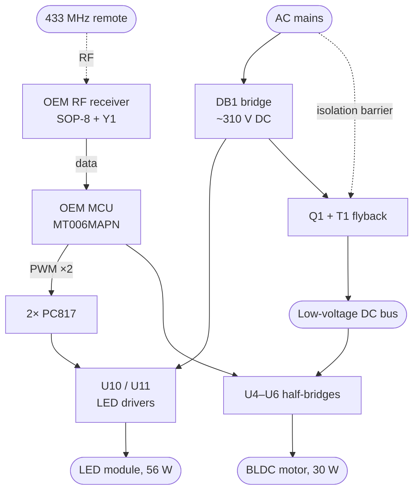

# SmarterFan

Replacing the brain of a **Novohome NH-VTR500** ceiling fan (retractable blades, dimmable CCT LED, 433 MHz remote) with an ESP32, without touching its mains-side power electronics.

The stock controller works, but its firmware is locked behind an undocumented mask-ROM MCU: the lowest brightness step is still uncomfortably bright, there are only three fixed colour temperatures, and there is no way to talk to it other than the handheld remote. This project intercepts the two control paths that matter and hands them to an ESP32, while leaving the mains rectifier, the LED drivers, the isolation barrier and the motor power stage exactly as the manufacturer built them.

---

## ⚠️ Safety

**This board carries mains voltage and hangs over your head.**

- Roughly the left third of the PCB is mains-referenced. Treat every component in that region as live whenever the fan is plugged in.
- The bulk capacitors are rated 450 V and hold charge after disconnection. **Bleed them and verify with a meter before touching anything.**
- Do not connect an oscilloscope ground clip to the mains-referenced section. Use an isolation transformer, or a differential/isolated probe.
- Do not connect USB to the ESP32 while the board is powered from mains. The secondary is isolated but coupled to the line through the Y-capacitors (CY1, CY2), so it can float at a significant voltage relative to earth. Use an isolation transformer, a USB isolator, or flash over OTA.
- This modification is not certified, not fire-tested, and voids any warranty and possibly your insurance. **You are responsible for what you hang from your ceiling.**

If any of the above is unfamiliar, this is not a good first electronics project.

---

## Goals

| Goal | Status in this scope |
|---|---|
| Dim the LEDs far below the OEM minimum, down to off | ✅ In scope |
| Continuous colour temperature instead of 3 fixed tones | ✅ In scope |
| Control from Home Assistant | ✅ In scope |
| Expose as a standard fan + light via Matter / HomeKit | ✅ In scope |
| Sunrise / light alarm | ✅ In scope |
| Keep the original handheld remote working | ✅ In scope |
| **Slow the fan below its lowest OEM speed** | ❌ **Not in this scope** — see [Out of scope](#out-of-scope) |

**Be clear on that last row.** This project routes fan commands *through* the stock MCU, so you get the OEM's six speeds from your phone instead of only from the remote. The lowest speed is still the lowest speed. Going below it requires taking over the motor drive directly, which is a separate effort.

---

## Target hardware

- **Fan:** Novohome NH-VTR500 — 4 retractable blades, 30 W DC motor, 6 speeds, 56 W LED with 3 colour tones
- **Control board silkscreen:** `XH-FSD03D5-1A`, dated `2025-09-19`

Other fans may use the same board; the silkscreen is the thing to match. If yours differs, the *approach* still applies but every reference designator below will be wrong.

---

## How the stock board works

Reverse-engineered from photographs and probing. Confidence is marked per row — see [Verification status](#verification-status).

| Ref | Part | Function |
|---|---|---|
| U3 | `MT006MAPN 5702S` | Main MCU, TSSOP-28. No public datasheet, no reflash path. |
| U4, U5, U6 | `4614 GA8T25` ×3 | One half-bridge per motor phase (U/V/W) |
| U10, U11 | `MT9722S` | Mains-side LED drivers, one per colour channel |
| U2 (×3) | `PC817` | Optocouplers across the isolation barrier |
| Q1 | `WG D4N65SE` | 650 V MOSFET, primary switch of the main flyback |
| T1 | (red transformer) | Main flyback — the isolation barrier |
| D6 | `WG MBRD10200CT` | Secondary rectifier for the motor bus |
| Y1 + SOP-8 | `13.52 MHz` | 433 MHz superheterodyne receiver, feeds the `ANT` wire |
| R37, R38 | `102` (1 kΩ) | MCU → dimming optocoupler drive resistors |
| R33–R36 | `204` (200 kΩ) | High-value string feeding the third (mains-sense) optocoupler |
| R51, R52, R53 | `R050`, `R100` | Motor current-sense shunts |
| CE5, CE6 | 2.2 µF 450 V | Bulk caps for the two LED drivers |

### Block diagram



Two facts drive the entire design of this project:

1. **The remote is RF, not IR.** A 13.52 MHz crystal next to an SOP-8 and a wire soldered to the `ANT` pad is a 433.92 MHz superhet receiver. No line of sight involved.
2. **The dimming floor is a firmware limit, not a hardware one.** The MCU sends PWM through two optocouplers into the LED drivers' dim inputs. Nothing in the analogue path forbids going lower — Novohome simply chose not to.

---

## How the modification works

Two independent interventions, both reversible.

### 1. LED dimming — take over completely

Remove `R37` and `R38`. This isolates the MCU from the two dimming optocouplers, leaving both resistor pads floating. The ESP32 then drives the optocoupler LEDs directly through its own series resistors.

Measured on the stock board:

```
MCU pin high level      4.48 V
After the 1 kΩ          1.12 V   (PC817 forward drop)
Drive current           (4.48 − 1.12) / 1000 = 3.36 mA
```

To reproduce that from a 3.3 V GPIO:

```
R = (3.3 − 1.12) / 0.00336 ≈ 650 Ω  →  620 Ω
```

The MCU keeps driving its now-disconnected pins. Harmless.

Both pads then carry `ledc` PWM at **1 kHz**, the frequency the OEM MCU runs, and the two channels are one `cwww` light in ESPHome — brightness on one axis, the mix between the channels on the other. The mix is normalised by the larger of the two fractions, so the middle of the colour temperature range is *both* channels at full rather than each at half, and 100% brightness there is the full 56 W. The consequence is deliberate and visible: total output is not constant as the colour temperature sweeps, it roughly doubles toward the middle. That is what being able to reach full output costs.

`firmware/relay.yaml` is the config, and its `substitutions:` block at the top is every value that bring-up has to settle. **None of this has met hardware** — see [LED bring-up](#led-bring-up).

### 2. RF — relay through the ESP32

Remove the `102` resistor between the RF receiver's output and the MCU's input. The ESP32 then sits in the middle:

- **Receives** by tapping the RF receiver's output through a level shifter and decoding the OOK stream in software.
- **Transmits** by reconstructing packets and injecting them into the MCU's input, which cannot tell the difference.

This gives app control of the fan without touching the motor drive, and keeps the physical remote working — every command it sends is decoded by the ESP32 and either forwarded to the MCU (fan) or acted on directly (light).


**Tradeoff, stated plainly:** in relay mode the ESP32 becomes a single point of failure for the remote. If it hangs, the remote stops working entirely. Watchdog it. (Wi-Fi dropping out is *not* a problem — the relay runs on the RMT peripheral and never touches the network stack.)

---

## Hardware

### Bill of materials

| Item | Notes |
|---|---|
| **NodeMCU ESP32-C3 SuperMini** | The chosen board. Requires the antenna mod — see [antenna](#antenna). |
| BSS138 4-channel level shifter module | The ubiquitous $1 bidirectional I²C shifter. Used for the inject line. It also works on the sniff line, though it lifts the pad's low level from 0 V to 0.8 V. |
| Buck converter, **≥60 V input** → 5 V | ⚠️ MP1584 modules are 28 V max and are **not** suitable. |
| 2× 620 Ω resistor | Optocoupler drive |
| 1× 1 kΩ resistor | Series protection on the RF inject line |
| 1× `CD4050B` hex buffer *(optional)* | RF sniff line. Better than either a divider or the BSS138 on principle — push-pull output, CMOS input that does not load the pad — but this is a prediction, not a measured improvement. A correctly sized divider works, and at these timings source impedance is irrelevant: a 10k/22k divider against 50 pF of stray is a 0.76 µs edge, 0.6% of the shortest symbol. |
| 1× 220–470 µF, **105 °C or polymer** | Bulk on 3V3. Standard 85 °C parts dry out in a hot canopy. |
| 1× 100 nF ceramic | HF decoupling, mounted at the module pins |
| Header sockets | Socket the ESP32 — don't solder it down |
| U.FL → SMA pigtail + 2.4 GHz antenna | Route it out of the canopy |

### Tools

Oscilloscope (not optional — you cannot do the RF work without one), multimeter, fine-tip soldering iron, hot air or tweezers for 0805 removal, **isolation transformer** (strongly recommended), USB isolator if flashing over USB while powered.

### Wiring

```
 LV DC bus ──[ buck, ≥60 V in → 5 V ]──→ ESP32 5V pin
                                            │
                                        onboard LDO
                                            │
                                       ESP32 3V3 ──→ shifter LV

 MCU VDD (4.48 V) ───────────────────────────────→ shifter HV

 secondary GND ───┬── ESP32 GND
                  └── shifter GND

 GPIO 7  ──[620 Ω]──→ opto-side pad of R37   (LED channel A)
 GPIO 10 ──[620 Ω]──→ opto-side pad of R38   (LED channel B)
 GPIO 5  ──→ shifter LV1 ─── HV1 ──[1 kΩ]──→ MCU RF input pad
 GPIO 6  ←──[10k]──┬── RF receiver output pad     (divider: 3.08 V)
                   [22k]
                    │
                   GND
             (or a CD4050B buffer — see "Tap options")
```

**Critical points:**

- **`HV` comes from the MCU's own 4.48 V rail, not from your 5 V buck.** Driving the MCU's input above its supply forward-biases its ESD diode. Tap HV at the MCU's decoupling capacitor. Current draw is under 1 mA — the rail can handle it.
- **`LV` = 3.3 V, `HV` = 4.48 V.** Swapping the supply pins puts 4.48 V on your ESP32 GPIOs. Check the silkscreen twice.
- **Do not power the ESP32 from the fan's 4.48 V rail.** It was sized for an 8-bit MCU and an RF receiver, perhaps 20 mA. The C3 bursts to ~350 mA.
- **Keep the `1 kΩ` in the inject path.** It exists on the stock board for pin protection during power sequencing, contention limiting, EMC, and RF front-end isolation. All four reasons still apply to you.
- Mount your resistors on the adapter board, not as flying leads or tombstoned parts. This thing vibrates for years.

### Pin assignment (ESP32-C3 SuperMini)

| Signal | GPIO | Direction | Connects to |
|---|---|---|---|
| RF inject | **5** | out — RMT TX | shifter `LV1` → `HV1` → 1 kΩ → MCU RF input pad |
| RF sniff | **6** | in — RMT RX | Receiver output pad via a 10k/22k divider (3.08 V), or a `CD4050B` buffer. Size any divider so the high clears V<sub>IH</sub> = 2.475 V: 10k/10k gives 2.24 V and is below spec |
| LED channel A dim | **7** | out — LEDC | 620 Ω → opto-side pad of `R37` |
| LED channel B dim | **10** | out — LEDC | 620 Ω → opto-side pad of `R38` |
| Supply in | `5V` | — | buck output |
| Ground | `GND` | — | fan secondary GND, common with shifter and MCU |
| 3.3 V reference | `3V3` | out | shifter `LV` pin (~1 mA, reference only) |

Verify against your board's silkscreen — SuperMini clones vary.

#### Why these four

The board exposes GPIO 0–10, 20 and 21. Note that the classic-ESP32 "avoid GPIO 6–11" rule **does not apply** to the C3 — here the flash occupies 11–17.

| Pins | Why they're excluded |
|---|---|
| 11–17 | Internal flash |
| 18, 19 | USB D−/D+ — not broken out, and using them kills USB-JTAG |
| 2, 8, 9 | Strapping. 9 is boot mode and the BOOT button, 8 is the onboard LED and must be high at boot |
| 20, 21 | UART0 — keep for serial logs during bring-up |
| 0, 1, 3, 4 | **ADC1 channels.** Reserved: ADC2 is unusable while Wi-Fi is up, so these are the only analog inputs available if the shunts are ever read |
| **5, 6, 7, 10** | **Nothing to lose.** 5 is ADC2-only (already ruined by Wi-Fi); 6, 7 and 10 have no alternate function |

The RF pair sits on adjacent pins (5, 6) because both originally terminated at the level shifter, whose `LV1`/`LV2` are adjacent — one clean two-wire run. If the sniff line moves off the shifter onto its own divider or buffer, pin 6 is free to move wherever the layout prefers. The LED lines gain nothing from adjacency; each goes through its own resistor to a different pad.

Keeping the RF inject line off strapping pins matters most: they glitch at boot, and that garbage goes straight into the MCU. Non-strapping C3 pins are high-Z at reset, so the shifter's pull-ups simply hold the MCU input high — no transitions, nothing decoded, harmless.

Peripheral-to-pin binding is a non-issue: LEDC and RMT both route through the GPIO matrix, so any peripheral reaches any pin.

`GPIO 8` drives the onboard LED (active low) and is high at boot, so it is safe to use as a status indicator once firmware is running. Worth wiring into your firmware as a Wi-Fi/relay heartbeat — it's the only diagnostic you get without a ladder.

### Antenna

The generic "C3 SuperMini" boards have a documented antenna problem: the SMD antenna is not at its manufacturer's specified location and sits too close to the ground plane, which shields rather than radiates. Reported improvement from a quarter-wave wire mod is 6–10 dB.

Since a ceiling canopy is a poor RF environment anyway and the antenna needs routing outside it regardless, this is nearly moot — that antenna is getting replaced either way. **This project treats the antenna mod as mandatory, not optional.**

Remove the SMD antenna and solder a ~31 mm quarter-wave wire, or an SMA/U.FL pigtail, to the feed point. Then **strain-relieve the joint properly** — epoxy or hot glue at the pad, and anchor the cable so nothing tugs on it. A hand-soldered joint on a fixture that vibrates continuously for years is a fatigue failure waiting to happen, and this is the one place where the SuperMini is genuinely worse than a board with a proper U.FL connector.

Verify with ESPHome's `wifi_signal` sensor from the actual canopy position before closing it up. Better than −70 dBm and you'll never think about it again.

### Power

Take power from the low-voltage DC bus (the one behind D6 with the 470 µF caps), not the logic rail. Two cautions:

- **Measure the bus first** and spec the buck well above it — 60 V input rating covers regenerative spikes when the motor decelerates.
- **Keep the switcher away from the RF section.** You are adding a switching converter to a board with a sensitive 433 MHz front end that you still depend on. Shielded inductor, filtering on both sides, mounted at the far end. Verify remote range after installation.

---

## Remote protocol

**Solved. [PROTOCOL.md](PROTOCOL.md) is the reference** — wire format and symbol
timings, burst structure, the 32-bit frame (20-bit prefix, 5-bit key, 3-bit press
counter, 4-bit checksum), and the key table for all 20 buttons on the remote.

Three properties of it shape the rest of this project:

- **No rolling code.** The only state is a 3-bit press counter that advances once
  per physical press. Replay works: a captured frame is accepted whenever its
  counter differs from the last one the MCU saw. Synthesising an arbitrary
  command is a table lookup and a 4-bit XOR.
- **The AGC corrupts the first frame of every burst.** A decoder has to split the
  capture and try all five repeats; one that only decodes from the start of a
  capture — ESPHome's stock `rc_switch`, for one — loses the whole press. This is
  why `fan_rf` exists.
- **The line is never idle.** With nothing transmitting the receiver's AGC output
  is amplified band noise, so validation must be on pulse timing and frame
  fields, not on edge counting.

---

## Tooling

Two ESPHome builds, both loading local components out of `firmware/components`:

| Build | Needs | Does |
|---|---|---|
| `firmware/sniffer.yaml` | just the sniff tap — **no board modification** | Decodes the remote and prints it. This is the bring-up config and it stays receive-only. |
| `firmware/relay.yaml` | **both** modifications: the `102` removed with a shifter on both lines, *and* `R37`/`R38` removed | The same decode, plus injection into the OEM MCU's RF input and a `fan_rf.send_key` action for Home Assistant, plus the two LED channels as a `cwww` light driven from the remote's six light keys. `relay: fan` and the `R37`/`R38` removal are one change — with the resistors still fitted, the light has nothing driving it. |

| Component | Does |
|---|---|
| `firmware/components/fan_rf` | The decoder, in three stages. **Capture → frames:** split on gaps over 5 ms and decode each chunk independently as 32 PWM bits, all-or-nothing — one symbol matching neither bit throws the frame away, so a corrupt frame yields nothing rather than a half-guessed word. **Frame → packet:** split the word into prefix, key, press counter and checksum, and validate it. **Packets → presses:** count identical codewords to tell a tap from a hold. Nothing lower reaches up; the frame decoder has no idea what a press is. Two more stages sit on top for transmit: **packet → waveform**, the bit builders run backwards, and **presses → injection**, the relay decision below. |
| `firmware/components/adc_logger` | Streams an ADC pin's samples to the log continuously — no trigger, no thresholding — for looking at the pad as an analogue waveform. Wiring is `pad --[10k]-- GPIO3 --[10k]-- GND`; 10 kSa/s fits in the log's throughput. |

Every stage lives in `fan_rf/fan_rf_protocol.h`, free of ESPHome, Arduino and
IDF dependencies, so it compiles unchanged on the host. `fan_rf.cpp` is
plumbing: the console dumps, the binary sensors, and turning the relay's
decision into a `remote_transmitter` call.

### Watching the pipeline

Each stage prints, and each is a separate switch:

| Switch | Stage | Shows |
|---|---|---|
| `remote_receiver: dump: [raw]` | into stage 1 | Pulse durations for every capture, noise included. Off — see [Recording a log](#recording-a-log). |
| `fan_rf: dump_frames: true` | stage 1 out | One line per capture, listing the 32-bit words that decoded, before any field is inspected. Off by default. |
| `fan_rf: dump_commands: true` | stage 3 out | The decoded presses and held repeats. On by default. |

Both `fan_rf` dumps go out at `DEBUG`, and the frame dump stays silent on
captures that decode nothing — which is nearly all of them.

```
[D][fan_rf]: 65 symbols, 2 chunks, 1 frame: 10100001110110000010000111101001
[D][fan_rf]: press  key= 3 (bright+) counter=6  0xA1D82169
[D][fan_rf]: repeat key= 3 (bright+) counter=6  0xA1D82169  #1
```

`idle` sits below the inter-frame gap, so a capture normally carries exactly one
frame. Raise it to `12ms` and a whole burst lands on one line, comma-separated.

### Press and hold

The remote has no repeat code: a held button just keeps sending the same frame,
counter unchanged, one every 41.1 ms. Counting frames is the only way to tell a
tap from a hold.

```
frame:  1   2   3   4   5   6   7   8  ...
event:  P   .   .   .   .   R1  R2  R3
        ↑ press, ~37 ms      ↑ repeats, one per frame
```

The first frame of a new codeword is the press, reported immediately rather than
218 ms later when the burst ends. The next four are the rest of that same press
and are swallowed, so a tap fires exactly once — even when the AGC eats frame 1
and only four arrive. Everything past them is the button being held.

A run ends when the codeword changes or after `run_timeout` (250 ms, six frame
periods) with no frame. That timeout is what keeps the ninth press of one button
— the counter wraps at 8, so its codeword comes round again — from reading as
the same hold continuing. `press_frames: 1` disables the swallowing entirely and
reports every frame the remote sends.

`fan_rf` exposes decodes two ways. The trigger is the primitive:

```yaml
fan_rf:
  id: fan_remote
  press_frames: 5      # frames that make up one press
  run_timeout: 250ms   # silence that ends a run
  dump_frames: false   # stage 1 out, the raw 32-bit words
  dump_commands: true  # stage 3 out, the decoded presses
  on_code:
    - lambda: |-
        ESP_LOGI("remote", "key=%u counter=%u repeat=%lu",
                 key, counter, (unsigned long) repeat);
```

`repeat` is 0 for the press itself and 1, 2, 3… for each frame of a hold. Named
buttons are built on the same decode:

```yaml
binary_sensor:
  - platform: fan_rf
    name: "Remote: brightness up"
    key: bright_up       # any name from PROTOCOL.md §4, or a raw 0–31 value

  - platform: fan_rf
    name: "Remote: light on/off"
    key: light_toggle
    repeats: false       # a hold still registers once
```

Sensors pulse on held repeats by default, 41.1 ms apart, which is what makes
hold-to-dim work from an automation. An unlisted key is accepted as
valid-but-unnamed — the prefix and the checksum are what validate a packet, not
the key.

### Relaying

`firmware/relay.yaml` adds a `remote_transmitter` on GPIO 5 and turns decoded
presses back into frames on the MCU's input. **Not tested against hardware —
none exists yet.** What follows is the design, not a measurement.

**Nothing is transmitted on the press event.** The wait is the point: the press
fires on the first frame, and only what happens next says whether the button was
tapped or is being held.

```
frame:    1   2   3   4   5   6   7   8
event:    P   .   .   .   .   R1  R2  R3
inject:   .   .   .   .   .   F   F   F      held  — starts at the first repeat
inject:   .   .   .   .   . F                tapped — starts at the deadline
```

- **A repeat arrives first — it is a hold.** Inject immediately, then one more
  frame for every further repeat, so the injected stream tracks the hold in real
  time and stops when the button is released.
- **The deadline passes with no repeat — it was a tap.** Inject one frame.

The preamble goes out once, at the start of either. One received repeat every
41.1 ms against one injected frame occupying 41.4 ms is what keeps the stream in
step: nothing queues and nothing overlaps.

`relay_decision` is the deadline, and it is pure added latency on every tap. It
cannot go below `press_frames` × 41.1 ms = 205 ms, which is where the first
repeat of a held button lands. The default 230 ms is that plus jitter, and
deliberately *not* a whole extra frame period of margin for a dropped sixth
frame: if that frame is lost the deadline fires and one frame goes out, and
because a tap and the first frame of a hold are the same frame on the same
counter, the repeat behind it simply extends the stream. Lowering `press_frames`
shortens both windows together.

**The ESP32 owns the transmitted counter.** Once the `102` is removed the MCU
hears only the ESP32, so there is one counter sequence reaching it and nothing
to collide with. It advances once per injected press and holds for every frame
of that press — a counter that moved per frame would make a hold read as a
stream of separate presses, which is the whole thing the counter exists to
prevent. It is tracked independently of the counter observed from the remote,
and it is **not** persisted across a reboot: the ESP32 and the MCU share the
fan's secondary rail, so a power cycle resets both, and the two can only
disagree after an ESP32-only restart (OTA or a watchdog reset). The cost then is
at most one ignored command.

`relay: all` forwards every button. `relay: fan` drops the six light keys and is
what this becomes once the ESP32 drives the LEDs itself — which does not exist
yet, so switching now would just stop the light working. The split is a hand
transcription from the button names, not a computation: `bright ±`, `temp ±`,
`light on/off` and `cycle full bright` are light; `fan 1`–`fan 6`, `fan off`,
`fan forward` and `fan reverse` are fan; **`all off`, `night mode`, `natural
wind`, `2H` and `4H` are unverified** — nobody has pressed them with the fan
running and watched what moved — so `fan` mode forwards them, on the grounds
that dropping a button whose effect is unknown breaks something that works.

Commands can also originate on the ESP32:

```yaml
on_press:
  - fan_rf.send_key: fan_1        # a name from PROTOCOL.md §4, or a raw 0–31
```

One press, on the ESP32's own counter. No hold support in this pass.

**Two things this depends on and neither is measured.** Whether the MCU dedupes
on the counter at all is an inference from what the *remote* does; if it does
not, the counter policy costs nothing. And whether it accepts a single injected
frame is untested — the remote sends five, but that redundancy buys margin on a
noisy RF link and this goes over a wire. `tap_frames` is the knob if one turns
out not to be enough.

Host-side:

| Tool | Does |
|---|---|
| `tools/decode_fan_rf.py` | Decodes a captured log offline with generous tolerances, majority-votes the repeats, and checks that the counter increments by exactly one per press — an end-to-end check that nothing was dropped. |
| `tools/fan_rf_selftest.cpp` | Compiles the firmware's own header on the host and checks it: the full key table against the codewords in PROTOCOL.md, the checksum against every single-bit corruption, and the press/repeat state machine end to end through synthesised bursts — clean, AGC-skewed, frame 1 destroyed, held, and pure noise. The transmit path is checked by feeding what it emits straight back through the receive path, which is the validated one, plus literal assertions on the emitted durations. Needs no capture log. Give it one and it replays that too. |
| `tools/plot_adc.py`, `tools/adclog_to_csv.py` | Plot and convert `adc_logger` output. Dropped log lines are reported and drawn as gaps, never closed up. |

```
c++ -std=c++17 -O2 -o /tmp/fan_rf_selftest tools/fan_rf_selftest.cpp
/tmp/fan_rf_selftest                       # 858 checks, no log needed
/tmp/fan_rf_selftest log.txt               # replay a capture through the decoder
/tmp/fan_rf_selftest --dump log.txt        # what dump_frames would print
```

### Two settings that matter

**`idle: 4ms`** is deliberately shorter than the 8.79 ms inter-frame gap, so each
of the five repeats ends its own capture. `fan_rf` counts frames rather than
captures, so five captures still produce one press, and that press is reported
~37 ms after the first frame instead of ~218 ms after the whole burst. A longer idle
that holds a whole burst in one capture never terminates while a button is held —
frames arrive every 41.1 ms — until `receive_symbols` fills and the driver
truncates. The safe window is bounded below by the 865 µs longest in-frame space
and above by the 7.69 ms preamble gap.

**`filter` must stay below 136 µs**, the shortest real symbol under worst-case AGC
skew. At 200 µs the compressed early spaces are merged away and frame 1 is
destroyed. Do not reach for it to suppress noise bursts either — their median
pulse width is 343 µs and overlaps the real symbols completely. `filter_symbols:
120` is the right tool for that: garbage bursts run to at most 95 symbols against
a real packet's 166.

### Recording a log

`dump: raw` is commented out in `sniffer.yaml`, because it prints a line for
every capture, noise included, and buries the frames it exists to show. It is
the stage below `dump_frames` — the pulse durations that feed the decoder rather
than the words that come out of it.

Recording a new `log*.txt` needs it back, since both host tools parse those
`Received Raw:` lines:

    # uncomment `dump: [raw]` in firmware/sniffer.yaml, flash, then
    esphome logs firmware/sniffer.yaml > log.txt
    # and comment it out again

Press buttons in quick alternation. The per-second `wifi_signal` chatter is
silenced via `logger: logs: {sensor: WARN}` — raise it if you are chasing an
antenna or RSSI question.

---

## Firmware

**Platform not yet chosen.** The requirements are the same either way:

| Need | Peripheral |
|---|---|
| 2× dimming PWM | LEDC (6 channels available, 2 used) |
| 433 MHz OOK receive | RMT RX (C3 has 2) |
| 433 MHz OOK transmit | RMT TX (C3 has 2) |
| Wi-Fi + BLE | Built in |

Use RMT for the OOK rather than bit-banging. Once you do, the C3's single core is irrelevant — LEDC and RMT run autonomously and the Wi-Fi stack cannot disturb their timing.

### Platform options

| | Pros | Cons |
|---|---|---|
| **ESPHome** | Ready-made `ledc`, `remote_receiver`, `remote_transmitter`; native HA integration; OTA and light transitions for free | Less control; awkward if the project ever grows beyond stage 1 |
| **Arduino / PlatformIO** | Full control, large library ecosystem | You build your own API, OTA and HA/Matter integration |
| **ESP-IDF** | Most control, first-class peripheral access | Steepest; you build everything |

### Notes that apply regardless

- **The RF data line carries continuous noise when idle.** The receiver's AGC ramps to full gain with no transmitter present, so its output is amplified band noise. Decode with sync-word and pulse-timing validation, never edge counting. Real packets have quantised pulse widths; noise does not.
- **The dimming floor is set by the PC817, not by PWM resolution.** The optocoupler cannot pass arbitrarily narrow pulses, so the practical minimum duty is where pulse width exceeds roughly 10–20 µs. 12-bit resolution already exceeds what the opto can use — don't chase bits.
- **The dim PWM frequency and the minimum duty move together.** 1 kHz is what the OEM runs and what this firmware uses. Raising it for strobe margin shortens the pulse at a given duty — 1% at 2 kHz is 5 µs, below anything the PC817 is expected to pass — so `min_power` has to rise with it. Lowering it buys pulse width and costs flicker margin, with a floor around ~1 kHz to avoid stroboscopic beating against the blades. 1 kHz is where those two constraints meet, which is presumably why the OEM chose it.
- **The OEM's brightness floor is probably not an optocoupler artefact — but that is not settled.** The hypothesis was that a *fast* OEM PWM might be getting its narrow low-duty pulses swallowed by the opto, making the stock floor analogue rather than firmware. At 1 kHz the OEM's PWM is not fast, so that explanation is now unlikely. It is not disproven: the OEM's *minimum duty* is still unmeasured, and if it is low enough the pulses are narrow whatever the frequency. Measuring it is one line of the bring-up below.
- **Watchdog the relay path.** It is the only route from the remote to the fan once the `102` is removed.

---

## App

No custom app. Two standard integrations:

**Home Assistant** — the primary interface. A `light` entity with brightness and colour temperature, a `fan` entity with the six OEM speeds, and HA automations for the sunrise alarm. If firmware lands on ESPHome this is essentially free.

The colour temperature slider is one-dimensional and normalised, so it cannot express every pair of channel levels — "warm at 100%, cool at 40%" is not a point on it. `light.control` with explicit `cold_white:` and `warm_white:` values still reaches those, from an automation or the API. One entity is the right number; a second one for the raw channels would be two lights fighting over the same hardware.

**Matter** — expose the same fan and light so Apple Home, Google Home and Alexa can drive them without going through HA. Note the C3 is Wi-Fi only, so this is Matter-over-Wi-Fi; Thread would need a C6 or H2.

The light alarm runs as a brightness transition and only needs occasional NTP sync, so it survives Wi-Fi being intermittent.

---

## Verification status

Honesty about what is actually known, since someone may try to rebuild this.

### ✅ Measured

- `R37`, `R38` = 1 kΩ, MCU → two optocouplers
- MCU output high = 4.48 V; post-resistor = 1.12 V; drive current = 3.36 mA
- **OEM dimming PWM frequency = 1 kHz**, a 1 ms period. The duty range it sweeps is *not* measured — see below
- RF receiver SOP-8 output → 1 kΩ → MCU input
- Continuous activity on the RF data line with no button pressed
- Remote wire format, frame layout, checksum and the full 20-button key table — see [PROTOCOL.md](PROTOCOL.md). Every button on the remote captured and decoded, all field checks passing
- Receiver output pad floors at **0 V** unloaded and at **0.8 V** with a BSS138 channel attached — its two 10 kΩ pull-ups force ~620 µA into it. 0.8 V clears the MCU's 1.12 V V<sub>IL</sub> and not the ESP32's 0.825 V
- Blade mechanism contains gears **and ~10 cm springs**

### 🔶 Inferred, not confirmed

- Component identifications from silkscreen and package markings
- 433.92 MHz operation (from the 13.52 MHz crystal)
- Third optocoupler is a mains-side → MCU sense path (from the 200 kΩ string at R33–R36)
- Blade deployment is centrifugal, with the gear ring synchronising the four blades and the springs providing retraction
- The idle RF line activity is receiver AGC noise, not a real transmission. It is present continuously — a scope shows the ESP32 pin swinging 0.8–3.3 V with nothing transmitting; gaps in the ESPHome log are the `filter` discarding it, not silence

### ❓ Unknown — measure before building

- [ ] **Low-voltage DC bus voltage.** Everything about the buck depends on it. Nothing in this repo has measured it.
- [ ] LED channel forward voltage and current, per channel
- [ ] **OEM dimming duty range.** The frequency is 1 kHz; the minimum and maximum duty it sweeps between are not known, and the minimum is what would say whether the stock brightness floor is analogue or firmware
- [ ] **Which of `R37`/`R38` is the warm channel.** GPIO 7 goes to `R37` and GPIO 10 to `R38`, but nothing says which LED driver is which colour
- [ ] **Which way the dimming optocouplers go.** Whether more current through the PC817 means brighter or dimmer at the `MT9722S` dim input
- [ ] **The usable minimum duty through the optocouplers.** The configured 1% is a starting point, not a measurement
- [ ] Whether a pull-down exists on the MCU's RF input pin. If one does, it fights the shifter's 10 kΩ pull-up and the high level will not clear V<sub>IH</sub> — use a push-pull `74HCT1G34` instead.
- [ ] `4614` pinout
- [ ] Third optocoupler's actual function
- [ ] Whether the 20-bit prefix is a per-remote ID, a protocol constant, or both. Separating them needs a second remote — until then, do not assume a synthesised frame is accepted by any other unit.

### Pre-flight checks

Before trusting the level shifter, with the `102` removed and the ESP32 GPIO held high:

```
Measure the MCU RF input pin.
  ~4.48 V  →  no pull-down, you're clear
  ~2.2 V   →  pull-down present, switch to a push-pull buffer
```

Then capture a real packet off the receiver output, replay yours, and overlay the two traces. Matching timings and a clean 0.7 V → 4.48 V swing means the MCU will accept it.

### LED bring-up

Nothing in the LED path has been tested. Two facts the config has to guess — which pad is the warm channel, and which way the optocouplers go — are both answerable *before* removing anything, by watching the stock MCU do the job. Do that first.

Probe the **MCU side** of `R37` and `R38` only. That node is on the low-voltage secondary; the other side of the optocoupler is mains-referenced, and the [Safety](#️-safety) rules apply to it in full.

**1. Watch the OEM drive both pads.** Scope both, run the fan on mains, and step the remote through its brightness range.

- Confirm the 1 kHz. Then record the duty at each OEM step, and specifically **the lowest duty it ever uses.** If that is down at ~10 µs the optocoupler is the limit and the stock brightness floor is analogue; if it is tens of percent, the floor is firmware and there is room below it. This is the one measurement that settles the question, and it is gone once the resistors are out.
- **Duty rising with brightness means more current is brighter** → `led_inverted: "false"` in `firmware/relay.yaml`. Duty falling with brightness → `"true"`.

**2. Identify the warm channel.** Same setup: press `temp -` to the warmest tone and see which of the two pads carries the higher duty, then `temp +` to check it moves back. The pad that rises going warm is the warm channel. The config ships `cold_white: led_r38` / `warm_white: led_r37`; if it is `R38` that goes warm, swap those two ids and change nothing else.

**3. Cut and wire.** Remove `R37` and `R38`, then 620 Ω from GPIO 7 to `R37`'s opto-side pad and 620 Ω from GPIO 10 to `R38`'s. Flash `firmware/relay.yaml`. It ships `relay: fan`, which is only correct once this step is done.

**4. First light.** Set the light to 100% brightness and the middle of the colour temperature slider — both channels should be at full duty and the fixture at its full 56 W. Then:

- Bright at the bottom of the slider and dark at the top means the polarity guess is backwards: flip `led_inverted`.
- Cool where Home Assistant says warm means the channels are swapped: swap the two ids in the `cwww` block.
- One channel dead is wiring, not config — check that pad's duty on the scope before touching the YAML.

**5. Find where the light stops responding.** Drive the slider to each end first: at fully warm the cool channel is commanded to exactly zero, so `zero_means_zero` should hold it dark and each channel can be measured on its own.

Then sweep brightness down and watch the LED and the duty together. Two things compress the bottom of that sweep and both are expected:

- `min_power` is 1%, a 10 µs pulse at 1 kHz, against a PC817 whose practical minimum is roughly 10–20 µs. That is the bottom edge of the range, not inside it.
- With the default `gamma_correct: 2.8`, a brightness of 19% already gamma-corrects to 1% — so everything below about a fifth of the slider is pinned at `min_power`, and the whole bottom of the travel lives between roughly 10 and 12 µs.

Note the brightness at which the LED stops getting dimmer, and the brightness at which it drops out or starts flickering. Then raise `min_power_r37` and `min_power_r38` — independently; they are separate parts — to the lowest duty that channel passes cleanly. If the answer is well above 1%, dropping the PWM frequency buys pulse width at the same duty, down to the ~1 kHz floor set by strobing against the blades. Check that last point with the fan actually running.

---

## Reverting to stock

Every modification is a resistor removal. To undo:

1. Re-fit `R37` and `R38` (1 kΩ, 0805)
2. Re-fit the `102` between the RF receiver output and the MCU input
3. Remove the adapter board

Keep the removed resistors. Buy spares.

---

## Out of scope

**Direct BLDC motor control.** Running the fan slower than its lowest OEM speed means bypassing the stock MCU and driving `U4`–`U6` yourself — six PWM outputs with hardware dead-time, which the ESP32-C3 cannot do (it has zero MCPWM units; an S3 or C6 would be required).

There is also a mechanical limit that no controller can beat. Blade deployment is centrifugal, so below some RPM the springs win and the blades retract. The gear ring makes that retraction symmetric rather than dangerous, but it is a real floor. The usable range is the hysteresis band between the deploy speed and the hold speed — measure both before assuming there is headroom.

**Firmware for the OEM MCU.** `MT006MAPN` is an undocumented mask-ROM part. There is no toolchain and no reflash path. This is why the project works by interception rather than by replacement.

---

## Status

🚧 Early. Reverse engineering done, no hardware built yet. See [Unknown](#-unknown--measure-before-building) for the measurements blocking the first build.

The remote is fully solved — wire format, frame layout, checksum and all 20 buttons, documented in [PROTOCOL.md](PROTOCOL.md) and decoded on-device by `fan_rf`, which identifies every button and distinguishes a tap from a hold.

The RF path is written in both directions. `firmware/relay.yaml` builds, reconstructs frames and injects them on GPIO 5, and exposes `fan_rf.send_key` to Home Assistant; the round trip is checked on the host by feeding what the transmitter emits back through the decoder.

The LED path is written too: two `ledc` outputs into a `cwww` light, the six light keys bound to it, and `relay: fan` so those keys no longer reach the MCU. **None of it has met the board.** `R37` and `R38` are still fitted, no optocoupler has been driven from the ESP32, and no LED has been lit from this firmware — so every value in the config's `substitutions:` block is a guess, including which channel is warm and which way the optocouplers go. [LED bring-up](#led-bring-up) is the procedure for settling them; everything else on this side is hardware work.

## License

TBD.

## Disclaimer

Provided as-is, for reference. Mains voltage, an overhead fixture, and an uncertified modification. If you build this, you accept the consequences.
