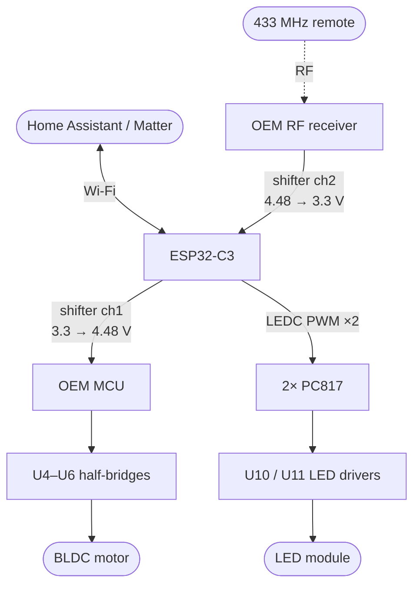

# SmarterFan

Replacing the brain of a **Novohome NH-VTR500** ceiling fan (retractable blades, dimmable CCT LED, 433 MHz remote) with an ESP32, without touching its mains-side power electronics.

The stock controller works, but its firmware is locked behind an undocumented mask-ROM MCU: the lowest brightness step is still uncomfortably bright, there are only three fixed colour temperatures, and there is no way to talk to it other than the handheld remote. This project intercepts the two control paths that matter and hands them to an ESP32, while leaving the mains rectifier, the LED drivers, the isolation barrier and the motor power stage exactly as the manufacturer built them.

---

## ⚠️ Safety

**This board carries mains voltage and hangs over your head.**

- Roughly the left third of the PCB is mains-referenced. Treat every component in that region as live whenever the fan is plugged in.
- The bulk capacitors are rated 450 V and hold charge after disconnection. **Bleed them and verify with a meter before touching anything.**
- Do not connect an oscilloscope ground clip to the mains-referenced section. Use an isolation transformer, or a differential/isolated probe.
- Do not connect USB to the ESP32 while the board is powered from mains. The secondary is isolated but coupled to the line through the Y-capacitors (CY1, CY2), so it can float at a significant voltage relative to earth. Use an isolation transformer, a USB isolator, or flash over OTA.
- This modification is not certified, not fire-tested, and voids any warranty and possibly your insurance. **You are responsible for what you hang from your ceiling.**

If any of the above is unfamiliar, this is not a good first electronics project.

---

## Goals

| Goal | Status in this scope |
|---|---|
| Dim the LEDs far below the OEM minimum, down to off | ✅ In scope |
| Continuous colour temperature instead of 3 fixed tones | ✅ In scope |
| Control from Home Assistant | ✅ In scope |
| Expose as a standard fan + light via Matter / HomeKit | ✅ In scope |
| Sunrise / light alarm | ✅ In scope |
| Keep the original handheld remote working | ✅ In scope |
| **Slow the fan below its lowest OEM speed** | ❌ **Not in this scope** — see [Out of scope](#out-of-scope) |

**Be clear on that last row.** This project routes fan commands *through* the stock MCU, so you get the OEM's six speeds from your phone instead of only from the remote. The lowest speed is still the lowest speed. Going below it requires taking over the motor drive directly, which is a separate effort.

---

## Target hardware

- **Fan:** Novohome NH-VTR500 — 4 retractable blades, 30 W DC motor, 6 speeds, 56 W LED with 3 colour tones
- **Control board silkscreen:** `XH-FSD03D5-1A`, dated `2025-09-19`

Other fans may use the same board; the silkscreen is the thing to match. If yours differs, the *approach* still applies but every reference designator below will be wrong.

---

## How the stock board works

Reverse-engineered from photographs and probing. Confidence is marked per row — see [Verification status](#verification-status).

| Ref | Part | Function |
|---|---|---|
| U3 | `MT006MAPN 5702S` | Main MCU, TSSOP-28. No public datasheet, no reflash path. |
| U4, U5, U6 | `4614 GA8T25` ×3 | One half-bridge per motor phase (U/V/W) |
| U10, U11 | `MT9722S` | Mains-side LED drivers, one per colour channel |
| U2 (×3) | `PC817` | Optocouplers across the isolation barrier |
| Q1 | `WG D4N65SE` | 650 V MOSFET, primary switch of the main flyback |
| T1 | (red transformer) | Main flyback — the isolation barrier |
| D6 | `WG MBRD10200CT` | Secondary rectifier for the motor bus |
| Y1 + SOP-8 | `13.52 MHz` | 433 MHz superheterodyne receiver, feeds the `ANT` wire |
| R37, R38 | `102` (1 kΩ) | MCU → dimming optocoupler drive resistors |
| R33–R36 | `204` (200 kΩ) | High-value string feeding the third (mains-sense) optocoupler |
| R51, R52, R53 | `R050`, `R100` | Motor current-sense shunts |
| CE5, CE6 | 2.2 µF 450 V | Bulk caps for the two LED drivers |

### Block diagram


Two facts drive the entire design of this project:

1. **The remote is RF, not IR.** A 13.52 MHz crystal next to an SOP-8 and a wire soldered to the `ANT` pad is a 433.92 MHz superhet receiver. No line of sight involved.
2. **The dimming floor is a firmware limit, not a hardware one.** The MCU sends PWM through two optocouplers into the LED drivers' dim inputs. Nothing in the analogue path forbids going lower — Novohome simply chose not to.

---

## How the modification works

Two independent interventions, both reversible.

### 1. LED dimming — take over completely

Remove `R37` and `R38`. This isolates the MCU from the two dimming optocouplers, leaving both resistor pads floating. The ESP32 then drives the optocoupler LEDs directly through its own series resistors.

Measured on the stock board:

```
MCU pin high level      4.48 V
After the 1 kΩ          1.12 V   (PC817 forward drop)
Drive current           (4.48 − 1.12) / 1000 = 3.36 mA
```

To reproduce that from a 3.3 V GPIO:

```
R = (3.3 − 1.12) / 0.00336 ≈ 650 Ω  →  620 Ω
```

The MCU keeps driving its now-disconnected pins. Harmless.

### 2. RF — relay through the ESP32

Remove the `102` resistor between the RF receiver's output and the MCU's input. The ESP32 then sits in the middle:

- **Receives** by tapping the RF receiver's output through a level shifter and decoding the OOK stream in software.
- **Transmits** by reconstructing packets and injecting them into the MCU's input, which cannot tell the difference.

This gives app control of the fan without touching the motor drive, and keeps the physical remote working — every command it sends is decoded by the ESP32 and either forwarded to the MCU (fan) or acted on directly (light).



**Tradeoff, stated plainly:** in relay mode the ESP32 becomes a single point of failure for the remote. If it hangs, the remote stops working entirely. Watchdog it. (Wi-Fi dropping out is *not* a problem — the relay runs on the RMT peripheral and never touches the network stack.)

---

## Hardware

### Bill of materials

| Item | Notes |
|---|---|
| **NodeMCU ESP32-C3 SuperMini** | The chosen board. Requires the antenna mod — see [antenna](#antenna). |
| BSS138 4-channel level shifter module | The ubiquitous $1 bidirectional I²C shifter. Used for the inject line. It also works on the sniff line, though it lifts the pad's low level from 0 V to 0.8 V — see [Tap options](#tap-options). |
| Buck converter, **≥60 V input** → 5 V | ⚠️ MP1584 modules are 28 V max and are **not** suitable. |
| 2× 620 Ω resistor | Optocoupler drive |
| 1× 1 kΩ resistor | Series protection on the RF inject line |
| 1× `CD4050B` hex buffer *(optional)* | RF sniff line. Better than either a divider or the BSS138 on principle — push-pull output, CMOS input that does not load the pad — but this is a prediction, not a measured improvement. A correctly sized divider works. See [Tap options](#tap-options). |
| 1× 220–470 µF, **105 °C or polymer** | Bulk on 3V3. Standard 85 °C parts dry out in a hot canopy. |
| 1× 100 nF ceramic | HF decoupling, mounted at the module pins |
| Header sockets | Socket the ESP32 — don't solder it down |
| U.FL → SMA pigtail + 2.4 GHz antenna | Route it out of the canopy |

### Tools

Oscilloscope (not optional — you cannot do the RF work without one), multimeter, fine-tip soldering iron, hot air or tweezers for 0805 removal, **isolation transformer** (strongly recommended), USB isolator if flashing over USB while powered.

### Wiring

```
 LV DC bus ──[ buck, ≥60 V in → 5 V ]──→ ESP32 5V pin
                                            │
                                        onboard LDO
                                            │
                                       ESP32 3V3 ──→ shifter LV

 MCU VDD (4.48 V) ───────────────────────────────→ shifter HV

 secondary GND ───┬── ESP32 GND
                  └── shifter GND

 GPIO 7  ──[620 Ω]──→ opto-side pad of R37   (LED channel A)
 GPIO 10 ──[620 Ω]──→ opto-side pad of R38   (LED channel B)
 GPIO 5  ──→ shifter LV1 ─── HV1 ──[1 kΩ]──→ MCU RF input pad
 GPIO 6  ←──[10k]──┬── RF receiver output pad     (divider: 3.08 V)
                   [22k]
                    │
                   GND
             (or a CD4050B buffer — see "Tap options")
```

**Critical points:**

- **`HV` comes from the MCU's own 4.48 V rail, not from your 5 V buck.** Driving the MCU's input above its supply forward-biases its ESD diode. Tap HV at the MCU's decoupling capacitor. Current draw is under 1 mA — the rail can handle it.
- **`LV` = 3.3 V, `HV` = 4.48 V.** Swapping the supply pins puts 4.48 V on your ESP32 GPIOs. Check the silkscreen twice.
- **Do not power the ESP32 from the fan's 4.48 V rail.** It was sized for an 8-bit MCU and an RF receiver, perhaps 20 mA. The C3 bursts to ~350 mA.
- **Keep the `1 kΩ` in the inject path.** It exists on the stock board for pin protection during power sequencing, contention limiting, EMC, and RF front-end isolation. All four reasons still apply to you.
- Mount your resistors on the adapter board, not as flying leads or tombstoned parts. This thing vibrates for years.

### Pin assignment (ESP32-C3 SuperMini)

| Signal | GPIO | Direction | Connects to |
|---|---|---|---|
| RF inject | **5** | out — RMT TX | shifter `LV1` → `HV1` → 1 kΩ → MCU RF input pad |
| RF sniff | **6** | in — RMT RX | Receiver output pad via a 10k/22k divider (3.08 V), or a `CD4050B` buffer. Size any divider so the high clears V<sub>IH</sub> = 2.475 V: 10k/10k gives 2.24 V and is below spec. See [Tap options](#tap-options) |
| LED channel A dim | **7** | out — LEDC | 620 Ω → opto-side pad of `R37` |
| LED channel B dim | **10** | out — LEDC | 620 Ω → opto-side pad of `R38` |
| Supply in | `5V` | — | buck output |
| Ground | `GND` | — | fan secondary GND, common with shifter and MCU |
| 3.3 V reference | `3V3` | out | shifter `LV` pin (~1 mA, reference only) |

Verify against your board's silkscreen — SuperMini clones vary.

#### Why these four

The board exposes GPIO 0–10, 20 and 21. Note that the classic-ESP32 "avoid GPIO 6–11" rule **does not apply** to the C3 — here the flash occupies 11–17.

| Pins | Why they're excluded |
|---|---|
| 11–17 | Internal flash |
| 18, 19 | USB D−/D+ — not broken out, and using them kills USB-JTAG |
| 2, 8, 9 | Strapping. 9 is boot mode and the BOOT button, 8 is the onboard LED and must be high at boot |
| 20, 21 | UART0 — keep for serial logs during bring-up |
| 0, 1, 3, 4 | **ADC1 channels.** Reserved: ADC2 is unusable while Wi-Fi is up, so these are the only analog inputs available if the shunts are ever read |
| **5, 6, 7, 10** | **Nothing to lose.** 5 is ADC2-only (already ruined by Wi-Fi); 6, 7 and 10 have no alternate function |

The RF pair sits on adjacent pins (5, 6) because both originally terminated at the level shifter, whose `LV1`/`LV2` are adjacent — one clean two-wire run. If the sniff line moves off the shifter onto its own divider or buffer, pin 6 is free to move wherever the layout prefers. The LED lines gain nothing from adjacency; each goes through its own resistor to a different pad.

Keeping the RF inject line off strapping pins matters most: they glitch at boot, and that garbage goes straight into the MCU. Non-strapping C3 pins are high-Z at reset, so the shifter's pull-ups simply hold the MCU input high — no transitions, nothing decoded, harmless.

Peripheral-to-pin binding is a non-issue: LEDC and RMT both route through the GPIO matrix, so any peripheral reaches any pin.

`GPIO 8` drives the onboard LED (active low) and is high at boot, so it is safe to use as a status indicator once firmware is running. Worth wiring into your firmware as a Wi-Fi/relay heartbeat — it's the only diagnostic you get without a ladder.

### Antenna

The generic "C3 SuperMini" boards have a documented antenna problem: the SMD antenna is not at its manufacturer's specified location and sits too close to the ground plane, which shields rather than radiates. Reported improvement from a quarter-wave wire mod is 6–10 dB.

Since a ceiling canopy is a poor RF environment anyway and the antenna needs routing outside it regardless, this is nearly moot — that antenna is getting replaced either way. **This project treats the antenna mod as mandatory, not optional.**

Remove the SMD antenna and solder a ~31 mm quarter-wave wire, or an SMA/U.FL pigtail, to the feed point. Then **strain-relieve the joint properly** — epoxy or hot glue at the pad, and anchor the cable so nothing tugs on it. A hand-soldered joint on a fixture that vibrates continuously for years is a fatigue failure waiting to happen, and this is the one place where the SuperMini is genuinely worse than a board with a proper U.FL connector.

Verify with ESPHome's `wifi_signal` sensor from the actual canopy position before closing it up. Better than −70 dBm and you'll never think about it again.

### Power

Take power from the low-voltage DC bus (the one behind D6 with the 470 µF caps), not the logic rail. Two cautions:

- **Measure the bus first** and spec the buck well above it — 60 V input rating covers regenerative spikes when the motor decelerates.
- **Keep the switcher away from the RF section.** You are adding a switching converter to a board with a sensitive 433 MHz front end that you still depend on. Shielded inductor, filtering on both sides, mounted at the far end. Verify remote range after installation.

---

## Remote protocol

Decoded from two capture sessions off the OEM receiver's output (`firmware/sniffer.yaml`, `dump: raw`). Decoder: `tools/decode_fan_rf.py`.

### Wire format

Plain OOK, no carrier at baseband — the receiver has already demodulated. Two pulse widths, PWM-coded:

| Symbol | Mark | Space | Period |
|---|---|---|---|
| bit `0` | 288 µs | 704 µs | 1009 µs |
| bit `1` | 800 µs | 224 µs | 1009 µs |

Those are the profile nominals. Real symbols wander a long way from them while the receiver's AGC settles — see [AGC skew](#agc-skew).

One press transmits:

```
[335 µs mark][7.69 ms gap]              preamble, once
then 5 ×  [32 data bits][~330 µs stop mark][8.79 ms gap]
```

All five repeats carry an identical payload. Total airtime ≈ 215 ms. Gap timings are tight: 8787 µs ± 10 µs across 120 measurements.

### Packet layout

32 bits, MSB first:

| Bits | Field | Value |
|---|---|---|
| 0–15 | Device / remote ID | `0xA1D8` in every packet seen |
| 16–23 | Command | `0x21` brightness +, `0x23` colour temp +, `0x28` fan speed 1 |
| 24–27 | High nibble | `[domain flag][3-bit press counter]` |
| 28–31 | Low nibble | `high nibble XOR (command & 0x0F) XOR 6` |

The press counter advances +1 mod 8 on **every** press of any button, and is identical across the five repeats of one press. The domain flag is `1` for the light commands and `0` for the fan command — the inverse of command bit 3, consistent with the command space splitting `0x20`–`0x27` light / `0x28`–`0x2F` fan.

Example — brightness + with counter 6: `A1 D8 21 E9`.

Bit 28 reads as a constant `1` in every packet captured so far, but it is not a marker: `flag XOR (command bit 3)` is `1` by construction, so the nibble rule produces it for free. An earlier revision of this document called bits 24 and 28 markers; capturing a fan button disproved that for bit 24. The nibble rule holds on all 24 distinct codewords across three sessions.

**The counter is a sequence number, not a rolling security code.** It advances once per physical press and is identical across the five repeats, which is exactly what a receiver needs to tell a new press from a retransmission. It carries no state and no cryptography, so replay works: a captured packet is accepted whenever its counter differs from the last one the MCU saw.

**Caveats.** Three buttons across a 6-button-plus remote. The `XOR 6` constant survived the addition of a third command, which is meaningful evidence, but the domain flag and command bit 3 have been perfectly correlated in every packet so far — a light command with bit 3 set, or a fan command with it clear, would separate the two readings. Capture the remaining buttons before *synthesising* commands that have never been observed.

### AGC skew

The receiver does not merely settle in amplitude; it skews the duty cycle. Over the first frame of a transmission marks stretch and short spaces compress, converging by roughly frame 3:

| | frame 1 | frame 2 | frame 3 | frame 5 |
|---|---|---|---|---|
| short mark, mean | 303 µs | 278 µs | 270 µs | 266 µs |
| short space, mean | 209 µs | 231 µs | 240 µs | 244 µs |
| short space, min | 136 µs | 175 µs | 208 µs | 216 µs |

This drives two configuration constraints, and getting either wrong silently costs most of your decodes:

- **`filter` must sit well below the short symbol.** At `200us` the compressed early spaces fall under the threshold and are merged away, destroying frame 1 entirely.
- **`tolerance` must be at least ~40%** *for a width-only matcher.* Across both clean sessions the short space spans 136–312 µs, an inherent 39% spread that no choice of nominal covers at 25%. That spread is real, but it is not inherent to the signal — it is inherent to comparing four absolute windows. It is the mark/space *split* that moves; the bit period holds to 3.3 µs. See [What the symbol timings actually are](#what-the-symbol-timings-actually-are).

Frame 1 matters more than its 1-in-5 share suggests, because ESPHome's `rc_switch` decoder only ever starts at the beginning of a capture — it does not rescan. If frame 1 is unreadable the whole press is lost, even though frames 2–5 are perfect. That single fact accounted for a drop from 37/37 presses decoded to 5/37.

### Cold-press failure — what a full audit of every capture shows

Re-parsing every log with correct capture reassembly (the raw dumper flushes at a 256-char line buffer and continues on further lines; counting one line is not counting one capture) gives this:

| log | `filter` | tap | frames | clean | frame 1 clean |
|---|---|---|---|---|---|
| log2 | 200 µs | BSS138 | 150 | 118 | **0/30** |
| log3 | 100 µs | BSS138 | 184 | **184** | **37/37** |
| log4 | 100 µs | BSS138 | 14 | 10 | 2/5 |
| log5 | **20 µs** | BSS138 | 2 | **0** | 0/5 |
| log6 | **20 µs** | 10k/22k divider | 6 | **0** | 0/3 |
| log7 | **20 µs** | 10k/22k divider | 5 | **0** | 0/7 |
| log14 | 100 µs | 10k/22k divider | 47 | 4 | 0/11 |
| log15 | 100 µs | 10k/22k divider | 57 | 3 | 0/26 |
| log16 | 100 µs | 10k/10k divider | 103 | 11 | 1/23 |

Three separate conclusions fall out.

**`filter` has one demonstrated failure mode, and it is at the high end.** At 200 µs the pulse-width distribution is *truncated exactly at the threshold* — a hard pile-up at 200 µs with nothing below it — and 0 of 30 captures in log2 had a decodable frame 1. That is a mechanistic signature, not a correlation: the AGC-compressed short spaces fall under the threshold and are merged away.

The rule that follows is simply to keep `filter` below the shortest real symbol, which is 136 µs in the worst AGC-skewed case. 100 µs satisfies that with margin.

**An earlier revision of this document claimed `filter: 20us` "destroys the signal" on the basis that logs 5, 6 and 7 contain zero decodable frames. That claim was wrong** and is recorded here because the way it was wrong is instructive. Those three logs hold **13 frames between them**, and all three are cold-press sessions. At the cold-press clean rate measured elsewhere (18/207 = 8.7%), the expected count is 1.1 and the probability of observing zero is 31% — an unremarkable outcome. Applying a 100 µs glitch filter to those same captures in software, which should recover the frames if filtering were the mechanism, recovers none. There is no evidence 20 µs is harmful.

**A tap comparison that looks decisive and is not.** log3 (BSS138) decodes 184 of 184 frames; logs 14–16 (dividers) manage 4–18%. That reads as a verdict on the tap. It is not one, for two independent reasons.

First, **log3 is the only warm-press session and every divider session is cold**, so tap and press-style are perfectly confounded — there is no divider+warm capture anywhere in the data to separate them.

Second, and decisively, **a correctly sized divider cannot affect this protocol at all.** A 10k/22k divider is a 6.9 kΩ source. Against a realistic 50 pF of pin and stray capacitance that is a 0.76 µs edge, or 0.56% of the 136 µs shortest symbol. Consuming even 20% of a symbol would require ~1.8 nF — 36× more capacitance than a short lead to a CMOS pin carries. Noise fails the same test: flipping a 3.08 V level through 6.9 kΩ needs ~145 µA of injected current, far beyond capacitive coupling at these frequencies. The timings here are simply far too slow for source impedance to matter.

One real defect is specific and separate: the 10k/10k divider used in log16 puts 2.24 V on the pin against a V<sub>IH</sub> of 2.475 V — below spec. That is a sizing error, not an argument about dividers, and it applies to log16 alone.

The remaining variation between logs is warm versus cold, which is [AGC skew](#agc-skew) and nothing to do with the tap. Note also that the BSS138 is not a buffer: its LV side rises through a 10 kΩ pull-up and it only pulls *down* actively, so it shares the divider's source impedance while additionally lifting the pad's low from 0 V to 0.8 V. There was never a mechanism by which it should outperform a divider.

**What remains is a decoder limitation, not a signal problem.** ESPHome's `rc_switch` only ever attempts a decode from offset 0 of a capture — it never rescans. Frame 1 is the AGC-corrupted one. In log4, cold presses through the BSS138 gave frame 1 at 40% but frames 3–5 at **100%**: the packet was sitting in the capture, intact, in a place the decoder never looks.

So the original "cold-press failure" was never RF, never the AGC destroying the transmission, never amplitude or threshold or hysteresis. The transmission arrives, frames 2–5 are clean, and the on-device decoder gives up after the one frame that is not.

### Clean-frame rate by position in the burst

| log | f1 | f2 | f3 | f4 | f5 |
|---|---|---|---|---|---|
| log3 (warm, BSS138) | 100% | 100% | 100% | 100% | 100% |
| log4 (cold, BSS138) | 40% | 66% | **100%** | **100%** | **100%** |
| log16 (cold, divider) | 7% | 7% | 16% | 16% | 18% |

The AGC settles across a burst, exactly as [AGC skew](#agc-skew) describes — but only the BSS138 rows ever reach a usable state, and only past frame 1.

### What the symbol timings actually are

The remote uses the standard single-tick 1:3 PWM encoding:

    tick   = 252 us
    bit 0  = 1 tick mark + 3 tick space
    bit 1  = 3 tick mark + 1 tick space
    period = 4 ticks = 1008 us

Measured over 10592 symbols the bit period is **1009.1 µs with a standard deviation of 3.3 µs**. That is a crystal. The protocol is rigid; only the *split* between mark and space moves.

It moves because the receiver stretches marks and eats spaces by the same amount — +17/−16 µs on average, +89 µs in frame 1 while the AGC settles. The bias is common-mode, so it cancels in `mark + space` and leaves the period untouched. De-bias the measured symbols and you recover 255/754 in every frame position.

| | frame 1 (settling) | frame 5 (settled) |
|---|---|---|
| mark − space, short pair | +89 µs | +22 µs |
| mark − space, long pair | +90 µs | +22 µs |
| de-biased short / long | 256 / 753 | 255 / 754 |

So the decoders match each **pulse** loosely (252/756 µs at 50%, a sanity rail) and the **period** tightly (1009 µs at 5%, about 15 σ). Against the noise captures that accepts 2.2% of symbol pairs where width windows alone accept 7.3%, while decoding 331 frames instead of 327.

An earlier revision used 288/800/224/704 at 40%. Those were never measurements — they are 9/25/7/22 × 32, the grid forced by the deleted `rc_switch` profile's `pulse_length: 32`, and they sat *further* from the measured centres (23.5 µs average error) than 252/756 does (16.5 µs). Their 313.6 µs short-space ceiling was clipping real data.

### The on-device decoder

`firmware/components/fan_rf` is the answer to the paragraph above. It is an ESPHome external component that registers as a `remote_receiver` listener and, for every capture:

1. splits it on gaps longer than 5 ms, which is where the 8.79 ms inter-frame gap sits and no in-frame space comes close;
2. decodes **each frame independently** as 32 PWM bits — each pulse matched loosely (252/756 µs, 50%) and the bit period matched tightly (1009 µs, 5%);
3. majority-votes across whichever frames survived, rather than trusting any one of them;
4. validates the 16-bit device ID and the check nibble;
5. deduplicates on the press counter, so one press produces one event.

Step 2 is the whole point: `rc_switch` reads bits from offset 0 and stops. This one keeps going, so the AGC damaging frame 1 costs nothing as long as any later frame is clean — and past frame 1, later frames are clean essentially always.

The protocol itself lives in `fan_rf_protocol.h`, which has no ESPHome, Arduino or IDF dependency at all. `tools/fan_rf_selftest.cpp` compiles that exact header on the host and replays the captured logs through it, so the decoder is validated against real data before anything is flashed:

    c++ -std=c++17 -O2 -o /tmp/fan_rf_selftest tools/fan_rf_selftest.cpp
    /tmp/fan_rf_selftest --frames log3.txt      # 37/37 presses, counter +1 each
    /tmp/fan_rf_selftest --frames log4.txt      # the cold-press case

Across every log in the repo it decodes **74 presses with 74/74 field checks passing**, agreeing codeword-for-codeword with `tools/decode_fan_rf.py`. log2 is the sharpest demonstration: all 30 of its presses decode, and all 30 come from a frame other than the first — every one of them is a press the old `rc_switch_raw` sensors could not have seen.

Exposed two ways. The trigger is the primitive:

```yaml
fan_rf:
  id: fan_remote
  on_code:
    - lambda: |-
        ESP_LOGI("remote", "cmd=0x%02X counter=%u", command, counter);
```

and named buttons are built on it:

```yaml
binary_sensor:
  - platform: fan_rf
    name: "Remote: brightness up"
    command: brightness_up     # or a raw byte, e.g. 0x21
```

Unknown command bytes are accepted as valid-but-unnamed. Only three of the remote's buttons have been captured, and it is the device ID and the check nibble that validate a packet — not the command.

### Why `idle` is below the inter-frame gap

`idle: 4ms` is deliberately *shorter* than the 8.79 ms gap between repeats, so each of the five frames ends its own capture. That is the opposite of what this file said before, and the reason changed.

The old 12 ms kept a whole burst in one capture so a decoder could scan across the repeats. `fan_rf` no longer needs that — it deduplicates on the press counter, so five repeats arriving as five captures still produce one event. Meanwhile 12 ms carries a real fault:

> A held button transmits a frame every 41.1 ms with 8.79 ms between them. Nothing ever reaches 12 ms of idle, so the capture never terminates — it grows until `receive_symbols` fills at ~32 frames, then the driver truncates and re-arms, losing whatever lands during the re-arm. **That is 1.29 s of holding.**

At 4 ms a capture is 65 entries however long the button is held. It also cuts latency: a press is reported ~37 ms after the first frame rather than ~218 ms after the whole burst.

The safe window is bounded below by the longest space measured *inside* a decodable frame (865 µs over 10592 symbols) and above by the 7.69 ms preamble gap. 4 ms sits 4.6× above the floor and 1.9× below the ceiling.

Simulated end to end over all 14 logs, the press output is **identical at every idle from 12 ms down to 1.5 ms** — 74 presses, 74/74 field checks. What changes is only how many captures carry them:

| idle | captures emitted | max capture entries | decode events | presses |
|---|---|---|---|---|
| 12 ms | 1890 | 1089 | 74 | **74** |
| 6 ms | 2378 | 941 | 331 | **74** |
| 4 ms | 2531 | 941 | 331 | **74** |
| 2 ms | 2969 | 355 | 331 | **74** |

One thing this retires: the majority vote. Across the entire corpus **no capture ever produced two different codewords**, so the vote has never changed an outcome. It stays as cheap insurance, but with one frame per capture it no longer has anything to compare.

### Dumping raw frames

`firmware/components/fan_rf_dump` is the plain view underneath all of that. It prints every frame that decodes, as a 32-bit binary word, and does nothing else — no ID check, no checksum, no vote, no dedupe. The only test applied is whether the pulses match the remote's two symbol widths, and it is all-or-nothing per frame, so a corrupt frame prints nothing rather than a half-guessed word.

Frames are numbered with the preamble skipped, which makes a gap in the numbering the report that a frame was corrupt:

    [I][fan_rf_dump]: 323 symbols, 6 chunks, 4 frames decoded
    [I][fan_rf_dump]:   f2 10100001110110000010000111101001
    [I][fan_rf_dump]:   f3 10100001110110000010000111101001
    [I][fan_rf_dump]:   f4 10100001110110000010000111101001
    [I][fan_rf_dump]:   f5 10100001110110000010000111101001

It is silent on captures that yield nothing, which is nearly all of them — logs 10, 11 and 13 hold 1721 captures between them and produce **zero** lines.

The frame numbering needs a whole burst in one capture, so it only works with `idle` above the 8.79 ms inter-frame gap. At the configured `idle: 4ms` each frame is its own capture and every line reads `f1`. Set `idle: 12ms` when you want the position view back.

With `dump: raw` commented out, this is the receiver's only output — one block per press, nothing between presses.

It is standalone: it needs `remote_receiver` and nothing else, and carries its own copy of the frame decoder in `fan_rf_dump_protocol.h`. Drop the directory into another project and it works on its own. The trade is that the symbol timings exist in both components — re-measure the remote and both have to change. It can run alongside `fan_rf`, since every listener sees every capture, but it does not need it.

`tools/fan_rf_selftest.cpp --dump LOG` reproduces the same output from a captured log, through the same `walk_frames()` the component calls.

### Streaming the pad as analogue

`firmware/components/adc_logger` samples an ADC pin continuously and streams every sample to the log — no trigger, no ring buffer, no thresholding. Earlier triggered revisions each decided which windows were visible, and twice presented 800 ms of pure noise as if it were a failed press.

    esphome logs firmware/sniffer.yaml > log.txt
    .venv/bin/python tools/plot_adc.py log.txt          # visual
    python3 tools/scope_decode.py capture.csv           # threshold sweep

Wiring is `pad --[10k]-- GPIO3 --[10k]-- GND`, halving 4.48 V into the C3's ~3.1 V range at 12 dB attenuation.

Throughput is the limit: each sample costs 3 log characters and the logger carries roughly 30 kchar/s, so 10 kSa/s streams without loss. Every line is indexed, and dropped lines are reported and drawn as gaps rather than closed up — a silently shortened time axis would corrupt exactly the timing being measured.

### Capturing more

**`dump: raw` is commented out in `sniffer.yaml`.** It prints a `Received Raw:` line for every capture, noise included, and at `idle: 4ms` a session fragments noise into ~2500 captures — it buries the frames it exists to show. Day to day the log carries only `fan_rf_dump`'s decoded words, which is what you want to read.

Recording a **new** `log*.txt` needs it back, because `tools/decode_fan_rf.py` and `tools/fan_rf_selftest.cpp` both parse those lines:

    # uncomment `dump: [raw]` in firmware/sniffer.yaml, flash, then
    esphome logs firmware/sniffer.yaml > log17.txt
    # and comment it out again

The per-second `wifi_signal` chatter is also silenced, via `logger: logs: {sensor: WARN}`. Raise it if you are chasing an antenna or RSSI question.


Press buttons in quick alternation, and take the first press of any session as expendable.

`filter_symbols` will drop garbage bursts before they reach the log — they are at most 95 symbols against a real packet's 166 — but leave it off until the cold-press fault is closed, since that garbage is the evidence. Do not reach for `filter` instead: the garbage has a median pulse width of 343 µs and overlaps the real symbols completely, so at 200 µs it removes only a third of it while destroying frame 1.

Run `tools/decode_fan_rf.py` over the log afterwards. It decodes offline with generous tolerances, majority-votes the five repeats, and checks the counter increments by exactly one per press — an end-to-end check that nothing was dropped. `tools/fan_rf_selftest.cpp` does the same thing through the firmware's own decoder, so a disagreement between the two is a real signal about the component.

---

## Firmware

**Platform not yet chosen.** The requirements are the same either way:

| Need | Peripheral |
|---|---|
| 2× dimming PWM | LEDC (6 channels available, 2 used) |
| 433 MHz OOK receive | RMT RX (C3 has 2) |
| 433 MHz OOK transmit | RMT TX (C3 has 2) |
| Wi-Fi + BLE | Built in |

Use RMT for the OOK rather than bit-banging. Once you do, the C3's single core is irrelevant — LEDC and RMT run autonomously and the Wi-Fi stack cannot disturb their timing.

### Platform options

| | Pros | Cons |
|---|---|---|
| **ESPHome** | Ready-made `ledc`, `remote_receiver`, `remote_transmitter`; native HA integration; OTA and light transitions for free | Less control; awkward if the project ever grows beyond stage 1 |
| **Arduino / PlatformIO** | Full control, large library ecosystem | You build your own API, OTA and HA/Matter integration |
| **ESP-IDF** | Most control, first-class peripheral access | Steepest; you build everything |

### Notes that apply regardless

- **The RF data line carries continuous noise when idle.** The receiver's AGC ramps to full gain with no transmitter present, so its output is amplified band noise. Decode with sync-word and pulse-timing validation, never edge counting. Real packets have quantised pulse widths; noise does not.
- **The dimming floor is set by the PC817, not by PWM resolution.** The optocoupler cannot pass arbitrarily narrow pulses, so the practical minimum duty is where pulse width exceeds roughly 10–20 µs. 12-bit resolution already exceeds what the opto can use — don't chase bits.
- **Consider lowering the dim PWM frequency.** If the OEM runs it fast, narrow low-duty pulses may be getting swallowed by the optocoupler — which would mean the stock brightness floor is an optocoupler artefact. Sweep frequency and duty and find out. Stay above ~1 kHz to avoid stroboscopic beating against the blades.
- **Watchdog the relay path.** It is the only route from the remote to the fan once the `102` is removed.

---

## App

No custom app. Two standard integrations:

**Home Assistant** — the primary interface. A `light` entity with brightness and colour temperature, a `fan` entity with the six OEM speeds, and HA automations for the sunrise alarm. If firmware lands on ESPHome this is essentially free.

**Matter** — expose the same fan and light so Apple Home, Google Home and Alexa can drive them without going through HA. Note the C3 is Wi-Fi only, so this is Matter-over-Wi-Fi; Thread would need a C6 or H2.

The light alarm runs as a brightness transition and only needs occasional NTP sync, so it survives Wi-Fi being intermittent.

---

## Verification status

Honesty about what is actually known, since someone may try to rebuild this.

### ✅ Measured

- `R37`, `R38` = 1 kΩ, MCU → two optocouplers
- MCU output high = 4.48 V; post-resistor = 1.12 V; drive current = 3.36 mA
- RF receiver SOP-8 output → 1 kΩ → MCU input
- Continuous activity on the RF data line with no button pressed
- Remote wire format and packet layout — see [Remote protocol](#remote-protocol). Three capture sessions, 97 presses, all field checks passing; three commands identified
- Receiver output pad floors at **0 V** unloaded and at **0.8 V** with a BSS138 channel attached — its two 10 kΩ pull-ups force ~620 µA into it. 0.8 V clears the MCU's 1.12 V V<sub>IL</sub> and not the ESP32's 0.825 V
- Blade mechanism contains gears **and ~10 cm springs**

### 🔶 Inferred, not confirmed

- Component identifications from silkscreen and package markings
- 433.92 MHz operation (from the 13.52 MHz crystal)
- Third optocoupler is a mains-side → MCU sense path (from the 200 kΩ string at R33–R36)
- Blade deployment is centrifugal, with the gear ring synchronising the four blades and the springs providing retraction
- The idle RF line activity is receiver AGC noise, not a real transmission. It is present continuously — a scope shows the ESP32 pin swinging 0.8–3.3 V with nothing transmitting; gaps in the ESPHome log are the `filter` discarding it, not silence (see [Cold-press failure](#cold-press-failure))

### ❓ Unknown — measure before building

- [ ] **Low-voltage DC bus voltage.** Everything about the buck depends on it. Nothing in this repo has measured it.
- [ ] LED channel forward voltage and current, per channel
- [ ] OEM dimming PWM frequency and duty range
- [ ] Whether a pull-down exists on the MCU's RF input pin. If one does, it fights the shifter's 10 kΩ pull-up and the high level will not clear V<sub>IH</sub> — use a push-pull `74HCT1G34` instead.
- [ ] `4614` pinout
- [ ] Third optocoupler's actual function
- [ ] The rest of the remote's command set — the framing is solved (see [Remote protocol](#remote-protocol)), but only brightness +, colour temp + and fan speed 1 have been captured. Power, the remaining fan speeds and any down/decrease buttons are still unrecorded.

### Pre-flight checks

Before trusting the level shifter, with the `102` removed and the ESP32 GPIO held high:

```
Measure the MCU RF input pin.
  ~4.48 V  →  no pull-down, you're clear
  ~2.2 V   →  pull-down present, switch to a push-pull buffer
```

Then capture a real packet off the receiver output, replay yours, and overlay the two traces. Matching timings and a clean 0.7 V → 4.48 V swing means the MCU will accept it.

---

## Reverting to stock

Every modification is a resistor removal. To undo:

1. Re-fit `R37` and `R38` (1 kΩ, 0805)
2. Re-fit the `102` between the RF receiver output and the MCU input
3. Remove the adapter board

Keep the removed resistors. Buy spares.

---

## Out of scope

**Direct BLDC motor control.** Running the fan slower than its lowest OEM speed means bypassing the stock MCU and driving `U4`–`U6` yourself — six PWM outputs with hardware dead-time, which the ESP32-C3 cannot do (it has zero MCPWM units; an S3 or C6 would be required).

There is also a mechanical limit that no controller can beat. Blade deployment is centrifugal, so below some RPM the springs win and the blades retract. The gear ring makes that retraction symmetric rather than dangerous, but it is a real floor. The usable range is the hysteresis band between the deploy speed and the hold speed — measure both before assuming there is headroom.

**Firmware for the OEM MCU.** `MT006MAPN` is an undocumented mask-ROM part. There is no toolchain and no reflash path. This is why the project works by interception rather than by replacement.

---

## Status

🚧 Early. Reverse engineering largely done, no hardware built yet. See [Unknown](#-unknown--measure-before-building) for the measurements blocking the first build.

The remote's wire format and packet layout are fully decoded and warm presses decode 100%. One fault is open: cold presses do not decode, and the cause is not yet known — see [Cold-press failure](#cold-press-failure). Two candidate causes have been eliminated.

## License

TBD.

## Disclaimer

Provided as-is, for reference. Mains voltage, an overhead fixture, and an uncertified modification. If you build this, you accept the consequences.
